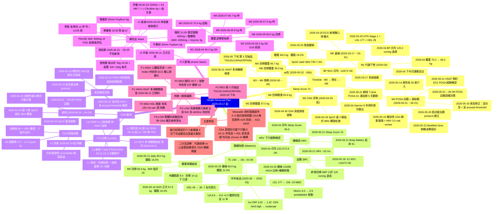

# Health Reversal Plan — Mindmap

> 資料來源：`PROGRESS.md`｜最後更新：2026-05-21｜視覺化生成：2026-05-22

```mermaid
mindmap
    root["Health Reversal Plan · 2026-03-17 起"]
        Timeline["Timeline · M0 → 現在 → M6"]
            M0["M0 基線 (2026-03-17 ~ 03-31)"]
                M0a["2026-03-17 系統啟動"]
                M0b["2026-03-25 馬偕健檢"]
                M0c["2026-03-25 HTN Stage 1 + LDL 177 + HDL 39"]
                M0d["2026-03-25 ECG 新增雙心房擴大"]
            M1["M1 代謝下修 (2026-04)"]
                M1a["2026-04 BP 月均 120.2 mmHg 達標"]
                M1b["2026-04 體重 70.0 → 69.0 kg"]
                M1c["2026-04 下半月運動空白"]
            M2["M2 OSA 浮現 (2026-04-29 起)"]
                M2a["2026-04-29 SpO2 連 3 晚低於 88% 觸發紅旗"]
                M2b["2026-04-30 OSA 深度調查啟動"]
                M2c["2026-04 Garmin 8 年資料首次匯出"]
            M3["M3 POSA 試驗 + 凍結期 (2026-05-01 ~ 05-21)"]
                M3a["2026-05-01 ~ 05-08 POSA 試驗設備決策"]
                M3b["2026-05-14 楔形枕 30 度介入"]
                M3c["2026-05-15 解剖性 OSA 敘事整理 + HRV CV risk review"]
                M3d["2026-05-19 表型修正：混合型 + 高 arousal threshold"]
                M3e["2026-05-20 肌功能治療 protocol 建立"]
                M3f["2026-05-21 HSAT 預約 6/21 POSA 經驗確認"]
                M3g["2026-05-21 網球 T-shirt POSA D1 凍結期 5 天觀察"]
                M3h["2026-05-22 Modified Sims 側睡姿勢設計"]
            Current["現在 (2026-05-22 · D66)"]
                Curr1["BP W21 月均 ~116/72 OK"]
                Curr2["體重 68.0 kg · 體脂 19.2%"]
                Curr3["Sleep Score 74"]
                Curr4["SpO2 nadir 83% T90 7.4%"]
            Forecast["M3 ~ M6 預期 (2026-06 ~ 09)"]
                F1["2026-06-21 HSAT 多項睡眠檢查"]
                F2["2026-05 下旬 第 3 月抽血 TG/LDL/UA/hsCRP/HDL"]
                F3["M3 目標體重 67.5 kg"]
                F4["M4 目標體重 66.7 kg"]
                F5["M5 目標體重 65.8 kg"]
                F6["M6 目標體重 65.0 kg"]
        Markers["關鍵指標 (Markers)"]
            BP["血壓 (BP)"]
                BP1["2026-03-25 健檢 153/88 HIGH 白袍+睡眠剝奪"]
                BP2["2026-04 月均 120.2/72.8 OK"]
                BP3["2026-05-18~21 W21 ~116/72 OK"]
                BP4["終極目標 SBP 小於 125 mmHg 達成"]
            Weight["體重與體組成"]
                W1["2026-03-25 健檢 69.6 kg · 體脂 21.5%"]
                W2["2026-05-16 W20 正式 67.6 kg · 體脂 19.4%"]
                W3["2026-05-21 daily 68.0 kg · 體脂 19.2%"]
                W4["M6 目標 65.0 kg · BMI 低於 23"]
                W5["內臟脂肪 9.0 · 目標 10 以下 已達"]
            Labs["半年抽血 (2025-09 → 2026-03)"]
                L1["TC 234 → 191 -43 OK"]
                L2["LDL 177 → 154 -23 MED"]
                L3["HDL 46 → 39 -7 反向惡化"]
                L4["HbA1c 6.0 → 5.9 prediabetes 鬆動"]
                L5["hs-CRP 3.02 → 1.42 -53% AHA high → moderate"]
                L6["UA 8.6 → 8.9 +0.3 體質性恆高 11 年"]
            Sleep["睡眠與 HRV"]
                S1["2026-04 月均 Sleep Score 66.6"]
                S2["2026-05-21 Sleep Score 74"]
                S3["2026-05-21 Body Battery 起床 61"]
                S4["2026-05-21 HRV ~20 ms"]
                S5["HRV 下行趨勢確認"]
        OSA["OSA 路徑"]
            OSA_trigger["偵測 (2026-04-24 ~ 04-29)"]
                O1["2026-04-24 SpO2 監測啟動"]
                O2["2026-04-29 連 3 晚 SpO2 低於 88% 觸發"]
                O3["2026-04-30 過敏性鼻炎整合行動方案"]
            OSA_pheno["表型確認流程"]
                P1["2026-05-01 ~ 05-08 POSA 試驗"]
                P2["2026-05-15 解剖性 OSA 自我定位敘事"]
                P3["2026-05-19 混合型 OSA + 高 arousal threshold 確認"]
                P4["2026-05-20 肌功能治療 protocol"]
                P5["2026-05-21 POSA 仰臥翻身假設經驗驗證"]
            OSA_interv["介入分層 (Levels)"]
                L_1["L1 環境：防螨枕套 + 避開塵螨 OK 持續"]
                L_2["L2 楔形枕 30 度 OK 2026-05-14 起 C1 T90 降 75%"]
                L_3["L3 網球 T-shirt POSA 2026-05-21 D1 5 天觀察中"]
                L_4["L4 洗鼻 2026-05-19 起 持續"]
                L_5["L5 HSAT 多項睡眠檢查 預約 2026-06-21"]
                L_6["L6 CPAP or 口腔裝置 待 HSAT 結果"]
            OSA_damage["OSA 修復視窗"]
                D1["治療後 BP + HRV 數週 ~ 3 個月回升"]
                D2["UA 預期降 0.5 ~ 1.0 mg per dL"]
                D3["仍在最理想 reversibility 候選區段"]
        Strategy["介入策略 (Active Stack)"]
            Supps["補充品 Stack"]
                S_v1["v1 基線 2026-03-25 馬偕健檢後建立"]
                S_v2["v2 升級 2026-05-11 正式生效"]
                S_freeze["凍結期 2026-05-21 ~ 05-25 不加新項"]
                S_morning["早餐 06:00 D3 2000IU + K2 MK-7 + L-Citrulline 4g + 益生菌"]
                S_pre_lunch["午餐前 30min Psyllium 5g"]
                S_pre_dinner["晚餐前 30min Psyllium 5g"]
                S_after_dinner["晚餐後 18:30 魚油 x2"]
                S_bedtime["睡前 21:00 鎂甘胺酸 400mg + 酸櫻桃 1000~2000mg + Glycine 3g"]
                S_food["食物層 南瓜籽 30g 15:30 + 菇蕈 100~130g 每天"]
                S_tea["茶飲 洛神花 x2 杯 早 + 14:00 前"]
                S_pending["PAUSE NAC 600mg x2 PSG 結果後評估"]
            Weight_plan["體重逆轉里程碑"]
                WM0["M0 2026-03 70.0 kg 起點"]
                WM1["M1 2026-04 69.2 kg OK"]
                WM2["M2 2026-05 68.3 kg OK 5/16 即達"]
                WM3["M3 2026-06 67.5 kg 待"]
                WM4["M4 2026-07 66.7 kg 待"]
                WM5["M5 2026-08 65.8 kg 待"]
                WM6["M6 2026-09 65.0 kg 目標"]
        TODO["待辦 / 開放議題"]
            T1["P1 HIGH HSAT 多項睡眠檢查 2026-06-21 已預約"]
            T2["P1 HIGH 心臟超音波 + 24h Holter 待安排 ECG 雙心房擴大"]
            T3["P2 MED 第 3 月抽血 TG/LDL/UA/hsCRP/HDL 2026-05 下旬"]
            T4["P2 MED 眼科 OCT + 視野 待安排 IOP 雙眼 19"]
            T5["P2 MED HDL 救援 有氧 150 min per 週 持續"]
            T6["P3 LOW 耳鼻喉聽力複檢 左耳 500 及 4000Hz 待安排"]
            T7["P3 LOW 腎臟科尿酸諮詢 待 OSA 確診後再評估"]
        Learning["主要學習"]
            Learn1["二分法逆轉：代謝改善 vs 心血管結構惡化 2026 健檢揭露"]
            Learn2["OSA 是隱形代謝下行驅力 UA 11 年恆高 + HDL 從未達標 均可由 chronic IH 解釋"]
            Learn3["Wearable 資料管線提早 3~6 個月發現問題 OSA 典型案例 4/29 抓到 → 6/21 HSAT"]
            Learn4["執行紀律高於介入新穎度 4 月下半追蹤空白是最大教訓"]
```
