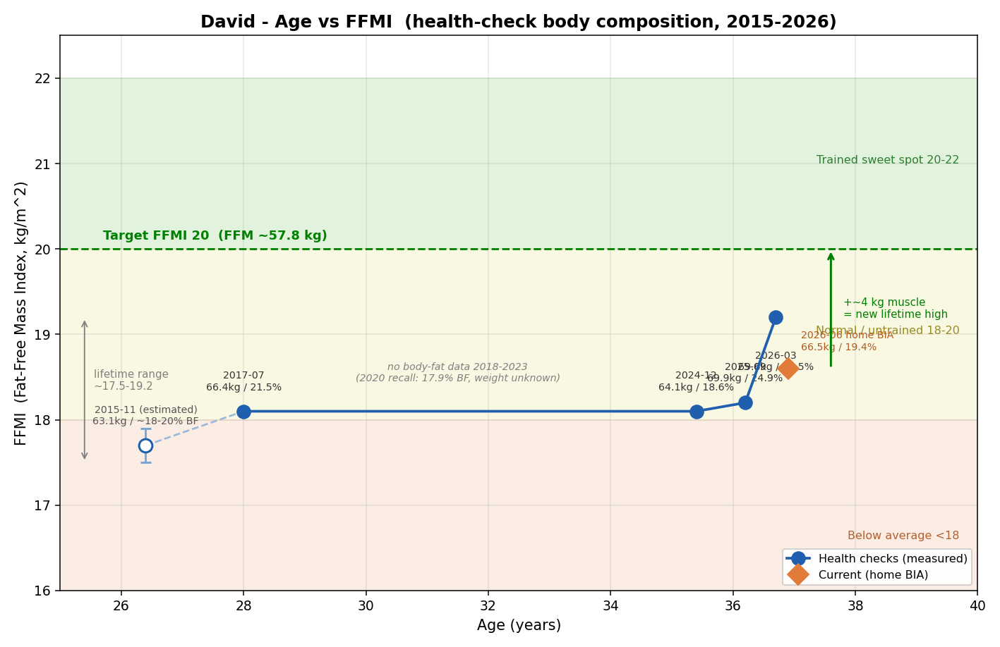

# 增肌目標、速度上限與 FFMI 軌跡（含肌力 vs 肌肥大）

**建立日期：** 2026-06-12（W24 D5）
**讀者錨點：** David（37 歲男性，170 cm，66.5 kg；體脂 19.4%、FFMI 18.5；recomp 相位；2021 後重啟重訓；UA 8.9、HTN、LVH + 雙心房擴大、OSA）
**用途：** 回答「該增多少肌、能多快、長起來什麼樣、該怎麼練」——把增肌科學定錨成個人化目標與預期。
**相關：** [Recomp 重訓菜單 1x/2x](2026-06-11-recomp-resistance-program-1x-2x.md)（練什麼）、[2 練執行 SOP](2026-06-12-training-execution-recovery-gate-and-post-workout-sop.md)（怎麼執行）、[目標重設與 workup](2026-06-11-recomp-target-reframe-and-workup-protocol.md)
**非醫療建議；個人化於上述背景。**

---

## 一、增肌有速度上限嗎？有，且你已過快速期

肌肉合成有生物天花板，超過的部分只變脂肪不變肌肉（這也是「乾淨 bulk」勝過「狂吃硬練」的原因）。

**Aragon 模型（每月增肌，佔體重 %）：** 新手 1–1.5%｜中階 0.5–1%｜進階 0.25–0.5%
**Lyle McDonald 模型（年資）：** 第 1 年 ~10–12kg → 第 2 年 ~5–6kg → 第 3 年 ~2–3kg → **第 4 年+ ~1–2kg/年**

**對你的校準**：你 2021 重啟至今約 4–5 年 → **中階**，生物上限 ~1–3kg 肌肉/年；再被**減脂赤字**（增肌大幅變慢）與 **OSA/睡眠**（壓低蛋白合成、升皮質醇）各砍一刀 → 實際**約 1–2kg/年，且季度尺度才量得出**。
**肌肉記憶例外**：流失後重練比從零快——但見 §四，你**沒有可記憶的肌肉高峰**，故此紅利對你有限。

---

## 二、肌肉量「越高越好」嗎？不是——地板效應

- **低肌肉量明確有害**（肌少症）；但 **adequate → 健美等級**的額外健康增益很小。
- **肌力/功能預測死亡率優於肌肉「量」**（新版肌少症診斷已改以肌力為主軸）。
- **肌肉對你的真實價值**：葡萄糖儲存槽（助 HbA1c 5.9）、維持靜息代謝率、37 歲儲備期建 reserve（抗未來肌少）、肌力/功能（長壽 independence）。
- **為何「最大化」對你不對**：需熱量盈餘（衝突減脂/內臟脂肪/UA/LDL）+ 更高訓練量（衝突 OSA 恢復/受傷史）；你的健康 ROI 不在這。

---

## 三、肌肉有沒有像體脂的「建議範圍」？有，但性質不同

| FFMI（去脂體重指數 = 瘦體重 ÷ 身高²）| 意義 |
|------|------|
| 18–20 | 一般/未訓練 |
| **20–22** | **訓練有成（甜蜜帶）** |
| 22–23 | 接近自然天花板 |
| >25 | 強烈暗示用藥 |

另有 **SMI（骨骼肌指數）**：男性 < 7.0 kg/m² = 肌少症（地板門檻）。

**為何沒有像體脂的「最佳區間」**：不對稱性——**體脂兩端都壞**（太低傷荷爾蒙/免疫、太高傷代謝）→ 給「最佳範圍」；**肌肉只有低端壞**（太低→肌少症）、高端沒有「太多肌肉是病」→ 給的是**「地板 + 自然天花板」而非中間最佳點**。

---

## 四、你的 FFMI 軌跡（健檢史 2015–2026）

| 健檢 | 身高 | 體重 | 體脂% | 瘦體重 | FFMI |
|------|------|------|-------|--------|------|
| 2015-11（~26y，體脂估）| 170 | 63.1 | ~18–20 | ~50.5–51.7 | **~17.7** ← 最低 |
| 2017-07（28y）| 169.9 | 66.4 | 21.5 | 52.1 | 18.1 |
| 2024-12（35y）| 169.7 | 64.1 | 18.6 | 52.2 | 18.1 |
| 2025-09（36y）| 169.8 | 69.9 | 24.9 | 52.5 | 18.2 |
| 2026-03（37y）| 168.5 | 69.6 | 21.5 | 54.6 | **19.2** ← 最高 |
| 現在（家用 BIA）| 170 | 66.5 | 19.4 | 53.6 | 18.6 |

**全生涯 FFMI ~17.5–19.2（最低 2015、最高 2026-03），全距僅 ~1.7。**

**最關鍵的發現**：瘦體重 11 年間只在 **50–55 kg** 游走，但體重 63→70kg、體脂 17.9→24.9% 大幅擺盪 → **你歷年的體重變化幾乎全是脂肪進出，肌肉始終貼地**（呼應健檢報告的 skinny-fat/TOFI 與「HDL 下降是肌肉缺席的指紋」）。
**推論修正**：FFMI 20 需瘦體重 57.8kg，**比你有史以來最高（54.6）還多 ~3–4kg** → 是**突破生涯新高的全新肌肉，非肌肉記憶可回收**。故 FFMI 20 是企圖心目標，2–3 年水平線合理甚至偏樂觀。
**資料限制**：2015 體脂為估計、2020（17.9% BF）無體重無法算、量測法不一（2017 InBody）、身高記錄有 1.5cm 變異 → FFMI 為近似比較，看趨勢。

---

## 五、Recomp 數字與時間軸

**現在 → 目標組成：**

| | 現在 | 目標（FFMI ~20、體脂 12–13%）|
|---|------|------|
| 體重 | 66.5 | ~65–66 |
| 脂肪量 | 12.9 kg | ~8 kg |
| 瘦體重 | 53.6 kg | ~57.8 kg |

> **減脂 ~4.5–5 kg ＋ 增肌 ~3–4 kg ＝ 體重只動 ~1.5 kg。**（這就是為何體重計是爛記分板。）

**兩階段時間軸（不會同時到）：**

| 階段 | 時間 | 體脂 | FFMI | 模式 |
|------|------|------|------|------|
| 減脂達標 | **+3–4 個月** | ~15% | ~19.2 | 赤字（體重續降至 ~63–64）|
| 增肌達標 | **+2–3 年** | ~12–13% | **~20** | 維持/微盈餘（體重回升至 ~66）|

**轉折**：到 ~15% 體脂後**該停止減重**（再降會掉肌肉）；增肌期**體重反而微升**。+4kg 新肌肉在持續赤字下長不出，**FFMI 20 必須先結束減脂、退出赤字**。記分板用**肌力進步 + 季度體組成**，非體重計。

---

## 六、+4kg 肌肉的圍度現實（別怕）

4kg 分散到全身，每部位只多一點點：

| 部位 | 增肌 | 圍度變化（估）|
|------|------|--------------|
| 大腿（每側）| ~1 kg | +2–2.5 cm |
| 胸/背 | ~1.2 kg | 胸圍 +3–4 cm |
| 上臂（每側）| ~0.4 kg | +1–1.5 cm |
| 小腿（每側）| ~0.3 kg | +~1 cm |

**且同時減脂 → 腰圍 −5～7 cm ↓**。淨視覺 = 腰明顯變細 + 肌肉線條飽滿一點 = **精實有型，非壯碩**。FFMI 20 = 精實運動員帶（健美選手 23–25+），且 2–3 年緩慢填充，是漸變非突變。

---

## 七、肌力 vs 肌肥大：你練肥大，不練肌力

| 變項 | 肌力 | 肌肥大 |
|------|------|--------|
| 重量 | 大 85–100% 1RM | 中 65–80% 1RM |
| 次數 | 低 1–6 | 中 6–15（範圍其實寬）|
| 組間休息 | 長 3–5 分 | 中 ~2 分 |
| 主要適應 | 神經 | 結構（橫斷面積）|
| 目標 | 舉更重 | 長更大 |

**現代證據**：肌肥大靠**容量（組×次×重量）+ 接近力竭 + 漸進超負荷**，rep range 很寬（5–30 下近力竭皆可長）；肌力較重**神經特異性**，要練重低次。「力量是練出來的技術，大小是堆出來的容量。」

**對你**：
1. 目標是 FFMI 20 = 肌肉**大小** → 本就該走肥大。
2. **心臟背景（LVH + 雙心房擴大 + HTN）→ 大重量/近 1RM/Valsalva 憋氣會飆 BP，是禁忌**（不只非必要）。
3. 受傷史 + OSA 恢復受限 → 大重量的關節/CNS 風險不划算。

**你現有 1x/2x 課表（中重量 8–15 下、RIR 1–2、出力吐氣、double progression）已是正確的肥大導向 + 內建心臟安全**——不用改，**唯一要管住「手癢試大重量」**。仍須漸進超負荷（中重量區慢慢加），會長力氣但那是副產品非目標。

---

## 結論

- **增多少**：~3–4kg 肌肉（FFMI 18.5 → 20），是**生涯新高**。
- **能多快**：肌肉用「年」算，全程 **2–3 年**；減脂那段 3–4 個月。
- **長怎樣**：精實非壯，腰更細（圍度每部位僅 +1–2.5cm）。
- **怎麼練**：**肌肥大導向**（你課表已對），絕不練大重量肌力（心臟禁忌），用肌力進步+季度體組成當記分板。

---

## 引用

- Aragon AA — 增肌速率上限模型；Lyle McDonald — 年資增肌上限模型
- Schoenfeld BJ — 肌肥大 rep range 寬度、容量驅動；2016 *Sports Med* 頻率 meta
- Kouri EM et al. 1995 — FFMI ~25 自然天花板
- AWGS 2019 / EWGSOP2 — 肌少症診斷改以肌力為主軸、SMI 切點
- 美國 AHA — 高血壓阻力訓練建議、避免 Valsalva
- 內部交叉：[1x/2x 課表](2026-06-11-recomp-resistance-program-1x-2x.md)、[2 練執行 SOP](2026-06-12-training-execution-recovery-gate-and-post-workout-sop.md)
