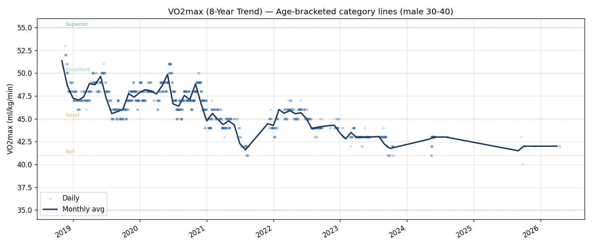
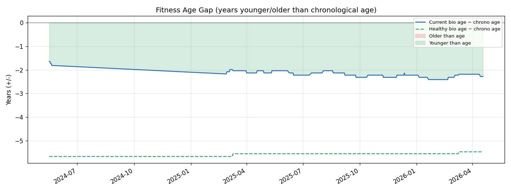
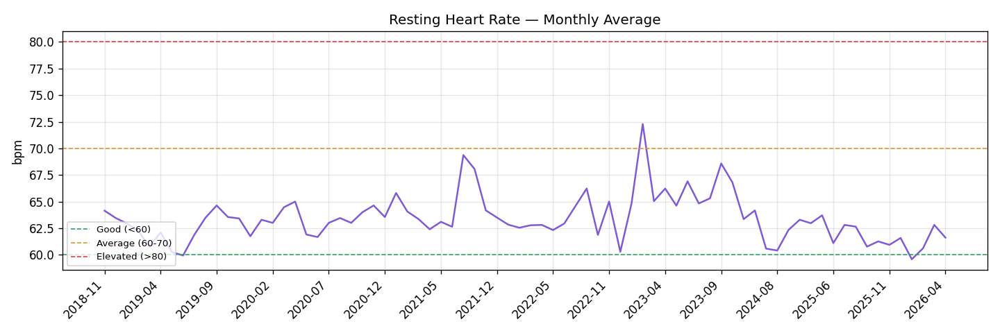
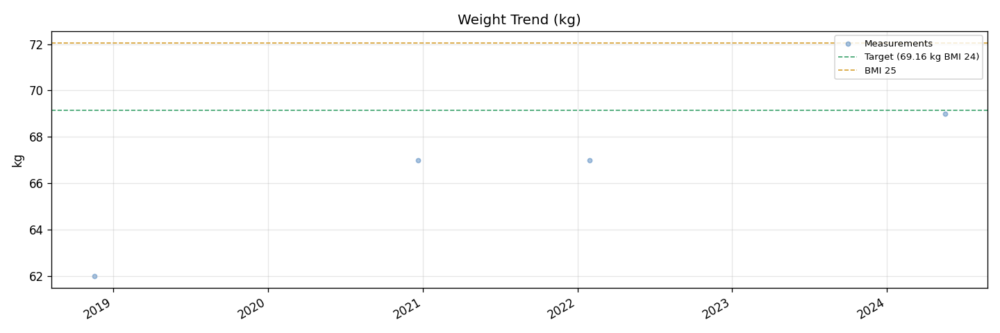
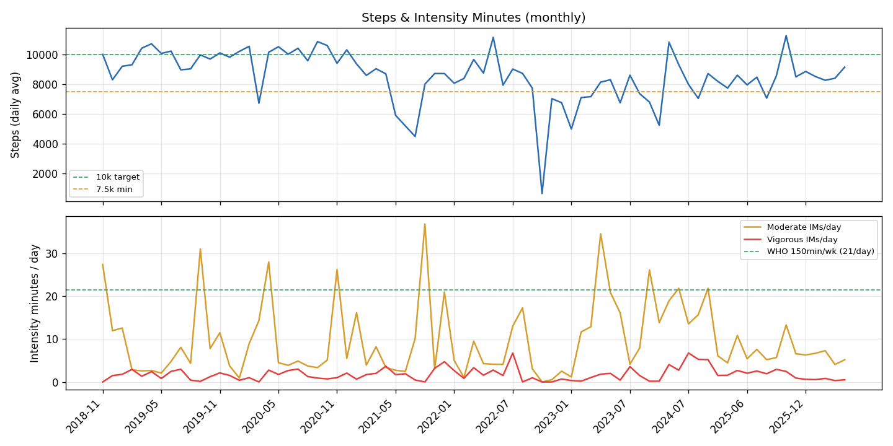
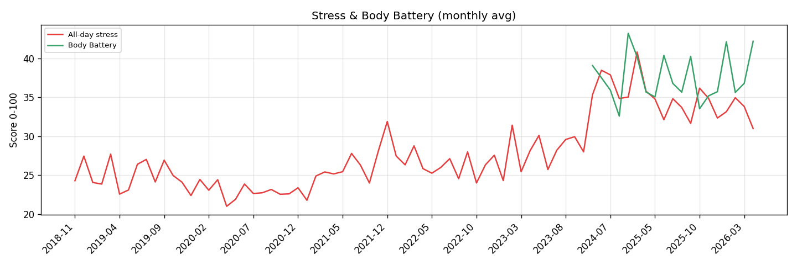
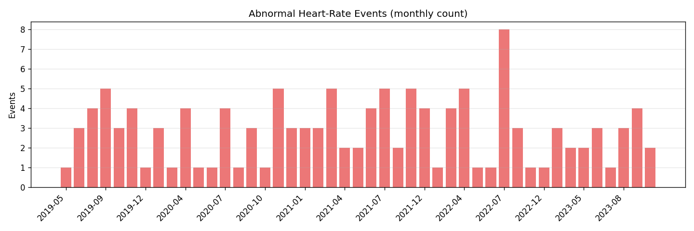
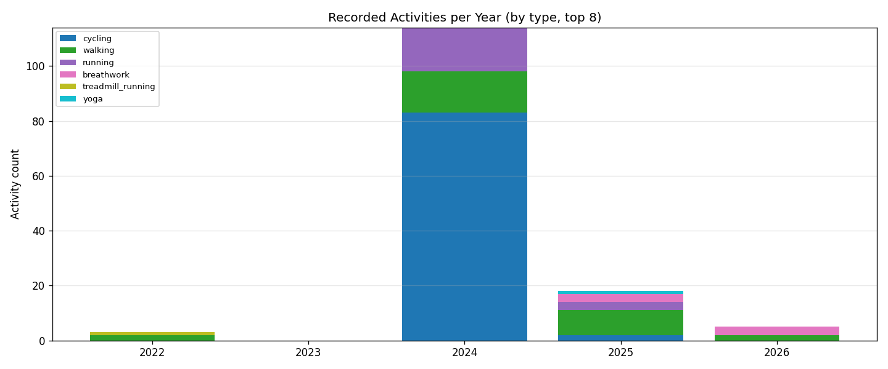

# Garmin 8-Year Comprehensive Health Analysis

_Generated: 2026-04-18 23:31 (Taipei)_  
_Source: Garmin GDPR export, user 72396565_

## 1. Data Inventory

| Data source | Records | Earliest | Latest |
|---|---|---|---|
| Daily summary (UDS) | 2220 | 2006-01-01 | 2026-04-18 |
| VO2max / MaxMet | 1530 | 2018-11-19 | 2026-04-16 |
| Fitness Age | 375 | 2024-05-17 | 2026-04-18 |
| BioMetrics (weight) | 4 | 2018-11-17 | 2024-05-17 |
| Abnormal HR events | 128 | 2019-05-25 | 2023-10-13 |
| Recorded activities | 140 | 2022-01-23 | 2026-04-16 |
| Health Status (LHA) | 196 | 2025-10-01 | 2026-04-18 |
| Sleep nights | 1680 | 2018-11-18 | 2026-04-18 |

## 2. Yearly Summary

| Year | UDS days | Steps | RHR | Stress | BB | Mod/day | Vig/day | Wkly IMs | VO2max (min→max) | Bio-age gap | AbnHR | Activities |
|---|---|---|---|---|---|---|---|---|---|---|---|---|
| 2018 | 45 | 8816 | 63.7 | 26.5 | — | 16.7 | 1.0 | 129 | 49.4 (48→53) | — | 0 | 0 |
| 2019 | 365 | 9780 | 62.2 | 24.8 | — | 7.8 | 1.7 | 78 | 47.3 (45→51) | — | 21 | 0 |
| 2020 | 366 | 9927 | 63.4 | 23.0 | — | 9.0 | 1.5 | 84 | 47.7 (44→51) | — | 27 | 0 |
| 2021 | 277 | 7586 | 64.5 | 26.1 | — | 10.0 | 2.0 | 98 | 44.4 (41→47) | — | 35 | 0 |
| 2022 | 323 | 7626 | 63.1 | 26.6 | — | 6.1 | 2.0 | 70 | 44.9 (43→47) | — | 25 | 3 |
| 2023 | 259 | 5902 | 66.0 | 28.0 | — | 15.1 | 1.1 | 120 | 42.9 (41→44) | — | 20 | 0 |
| 2024 | 96 | 8831 | 62.2 | 37.1 | 36.6 | 17.6 | 4.7 | 128 | 42.8 (41→43) | -1.7 | 0 | 114 |
| 2025 | 327 | 8527 | 62.1 | 34.8 | 37.3 | 8.1 | 2.1 | 86 | 41.8 (40→43) | -2.2 | 0 | 18 |
| 2026 | 108 | 8511 | 61.1 | 33.5 | 38.9 | 5.8 | 0.5 | 48 | 42.0 (42→42) | -2.3 | 0 | 5 |

_Wkly IMs = weekly intensity minutes (moderate×7 + vigorous×14, WHO formula). Bio-age gap: negative = fitness age younger than chronological. Weight omitted from this table — only 4 entries in 8 years of BioMetrics; see Notes._

## 3. Cross-Reference to PE Findings

### 3.1 Cardiovascular (ECG abnormalities present since 2015-11-14 age 26)

> **Timeline correction (2026-04)**: Original write-up framed the ECG ischemia as a "2025 new finding". Review of historical PE reports (jimei 2015/2017 archive in `reviews/annual/source-images/2017-jimei/`) confirms **LVH by voltage + ST depression (II/III/AVF) + T-wave inversion (I/AVL/V4-V6) have been present since age 26**, i.e. ~11 years. The 2026-03-25 finding of newly added **biatrial enlargement + anterior ST elevation** is the structural progression, not the ischemia/LVH pattern itself.

- **RHR 12 months before 2025-09 exam**: 62.6 bpm (n=221 days)
- **RHR 13-24 months before**: 63.0 bpm (n=111 days)
- **RHR change**: -0.4 bpm in the year before the 2025 exam (Garmin does not predate the 2015 ECG finding)
- **Abnormal HR events 12 months pre-exam**: 0 (of 128 total recorded)
- **Earliest documented ECG abnormality**: 2015-11-14 (age 26) at H&B jimei health center, predating all Garmin wearable data (Garmin coverage starts 2018-11)

### 3.2 VO2max / Cardiorespiratory fitness

- **VO2max 12 months before 2025-09 exam**: — — data gap (watch not worn 2024-08 → 2025-02)
- **VO2max 13-24 months before**: 42.5
- **VO2max since 2025-09**: 41.9
- **All-time peak**: 53.0 on 2018-11-19
- **All-time low**: 40.0 on 2025-09-24
- **Net change from peak**: -13.0 ml/kg/min (-24.5%)

### 3.3 Period 2025-09 → 2026-03 (between the two PE exams)

_2026-03 PE improvements: LDL 177→154, TC 234→191, body fat 24.9→21.5%, HbA1c 6.0→5.9%_

| Metric | 6 mo before 2025-09 exam | Between exams (2025-09→2026-03) |
|---|---|---|
| Daily steps | 8069 | 8905 |
| RHR | 62.4 | 61.0 |
| Stress | 34.8 | 34.2 |
| Body Battery | 37.5 | 36.7 |
| Moderate IMs/day | 6.3 | 7.5 |
| Vigorous IMs/day | 2.2 | 1.0 |

### 3.4 Activity volume (for HDL, BP, BG control)

- **2026 YTD weekly intensity minutes**: 48 (WHO target: 150 moderate or 75 vigorous)
- **Best-activity year**: 2018 with 129 weekly IMs, VO2max 49.4
- **Lowest-activity year**: 2026 with 48 weekly IMs

## 4. Recent Health Status (LHA baseline comparison, 2025-09 onward)

| Metric | Status distribution |
|---|---|
| HRV | IN_RANGE: 165 (84%) · ONBOARDING: 16 (8%) · BELOW: 9 (5%) · ABOVE: 6 (3%) |
| HR | IN_RANGE: 174 (89%) · ONBOARDING: 16 (8%) · ABOVE: 6 (3%) |
| SpO2 | IN_RANGE: 170 (87%) · ONBOARDING: 18 (9%) · UNKNOWN: 6 (3%) · BELOW: 2 (1%) |

- Avg HRV: 23.3 ms · Avg HR: 67.0 bpm · Avg SpO2: 96.0% · Avg Respiration: 19.6 bpm
- _(Stress / Body Battery not in LHA metrics — see UDS yearly table above for those.)_

## 5. Charts

### VO2max 8-Year Trend

### Fitness Age Gap

### Resting Heart Rate

### Weight Trend

### Steps & Intensity Minutes

### Stress & Body Battery

### Abnormal HR Events

### Activities by Year/Type

## 6. Data Quality Notes

- **UDS coverage gaps** reflect periods when the watch was not worn or not synced.
- **Weight** is stored in grams in Garmin's export; values outside 40–120 kg filtered as entry errors.
- **VO2max** is device-algorithm-derived; newer devices (Fenix/Forerunner) tend to read higher than older models — treat large jumps across device changes with caution.
- **`nutritionLogs.json`** only contains MyFitnessPal **calorie goal** (not actual intake), so nutrition trends cannot be derived from Garmin.
- **`AbnormalHrEvents`** threshold is user-configured (usually ~100 bpm while inactive); counts are sensitive to this setting.
- **`healthStatusData` (LHA)** only populated from 2025-09 onward (feature launched then); baseline comparisons are recent-only.
