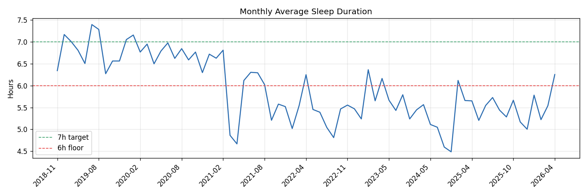
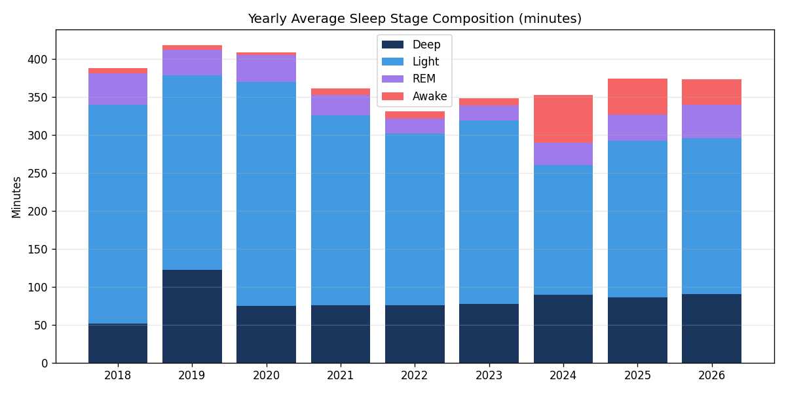
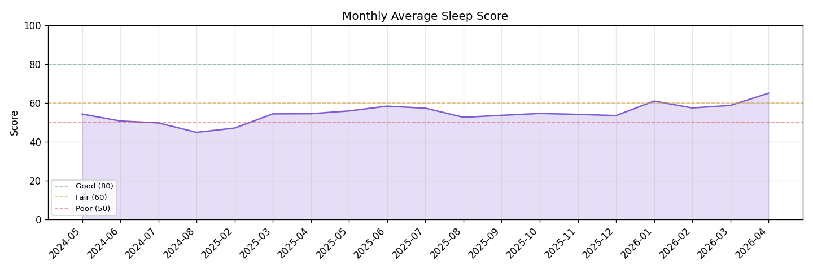
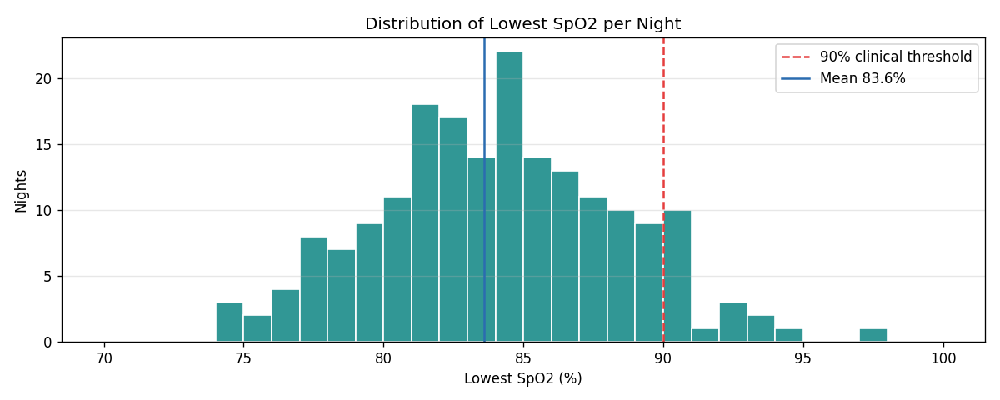
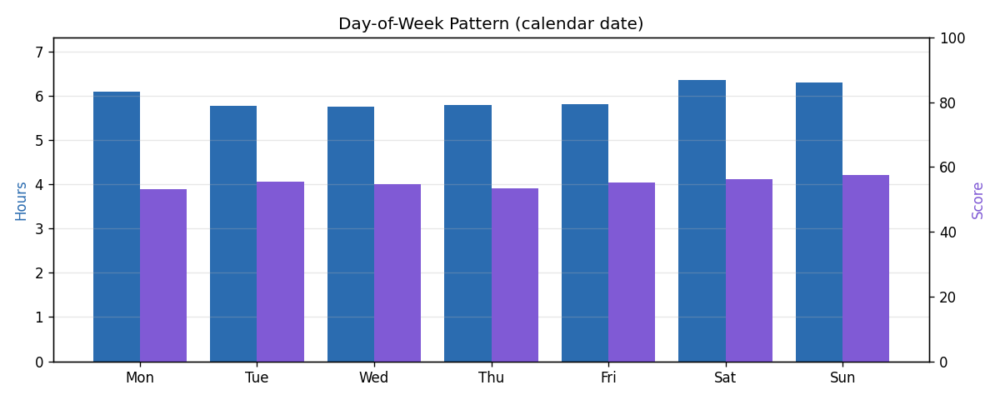
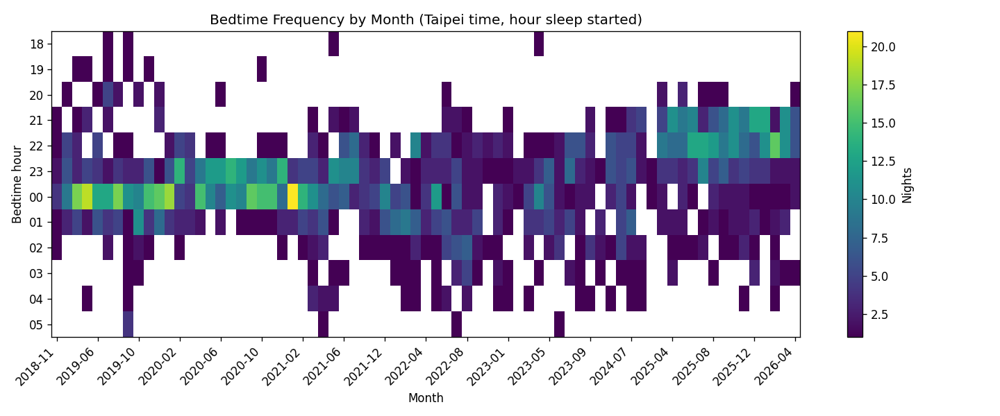
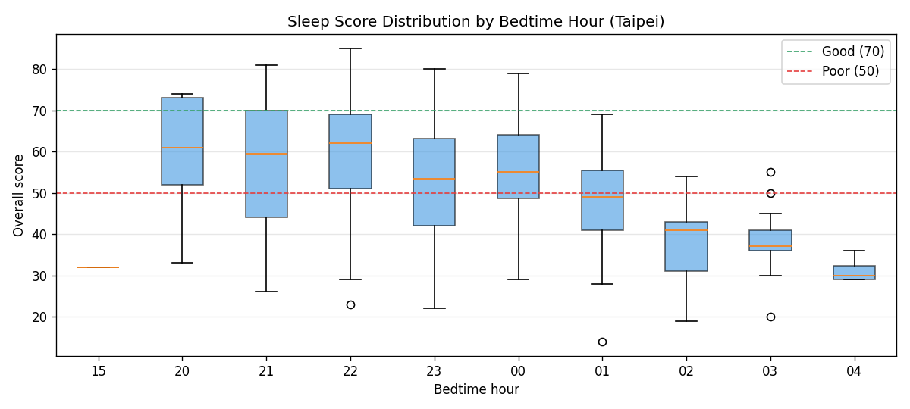
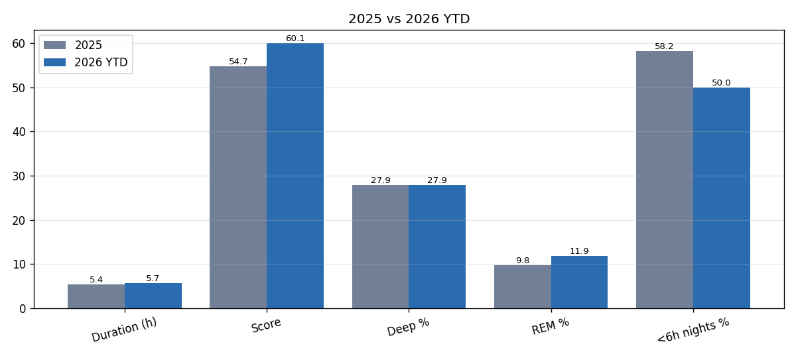
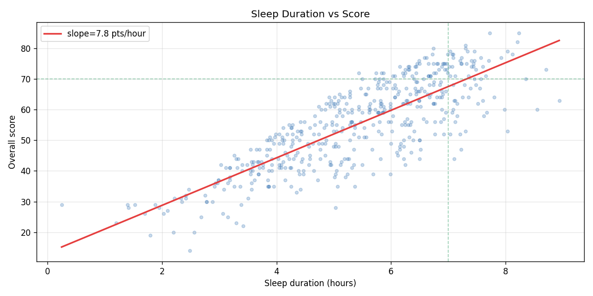

# Garmin Sleep History Analysis

_Generated: 2026-04-18 22:59 (Taipei)_  
_Source: Garmin GDPR export, user 72396565_

## 1. Coverage

- **Date range**: 2018-11-18 → 2026-04-18 (2709 calendar days)
- **Nights with valid sleep data**: 1680 (62.0% coverage)
- **Data gaps (>14 consecutive days missing)**: 7

  | Gap start | Gap end | Days missing |
  |---|---|---|
  | 2018-11-27 | 2019-03-08 | 100 |
  | 2021-08-17 | 2021-11-14 | 88 |
  | 2022-09-21 | 2022-11-07 | 46 |
  | 2022-11-07 | 2022-11-27 | 19 |
  | 2023-01-23 | 2023-02-23 | 30 |
  | 2023-10-16 | 2024-05-14 | 210 |
  | 2024-08-14 | 2025-02-27 | 196 |

## 2. Overall Averages (full history)

- **Sleep duration**: 5h58m per night
- **Sleep score**: 55.1
- **Deep sleep**: 1h26m (24.2% of total sleep)
- **Light sleep**: 4h01m (67.3%)
- **REM sleep**: 0h30m (8.5%)
- **Awake in bed**: 0h18m

## 3. Yearly Breakdown

| Year | Nights | Duration | Deep | REM | Awake | Score | Resp (bpm) | Avg SpO2 | Low SpO2 | Stress |
|---|---|---|---|---|---|---|---|---|---|---|
| 2018 | 10 | 6h20m | 0h51m | 0h40m | 0h06m | — | — | — | — | — |
| 2019 | 291 | 6h51m | 2h02m | 0h33m | 0h06m | — | — | — | — | — |
| 2020 | 314 | 6h44m | 1h14m | 0h34m | 0h03m | — | — | — | — | — |
| 2021 | 229 | 5h52m | 1h15m | 0h26m | 0h08m | — | — | — | — | — |
| 2022 | 209 | 5h20m | 1h15m | 0h19m | 0h09m | — | — | — | — | — |
| 2023 | 142 | 5h38m | 1h16m | 0h19m | 0h09m | — | — | — | — | — |
| 2024 | 87 | 4h49m | 1h29m | 0h29m | 1h02m | 50.1 | 14.1 | 97.0 | 97.0 | 26.9 |
| 2025 | 294 | 5h26m | 1h26m | 0h34m | 0h47m | 54.7 | 18.8 | 96.1 | 84.4 | 26.7 |
| 2026 | 104 | 5h39m | 1h30m | 0h43m | 0h34m | 60.1 | 19.4 | 95.8 | 82.8 | 25.5 |

## 4. Recent vs Historical

- **Last 90 days** (87 nights): 5h35m avg, score 59.6, deep 27.8%, REM 11.9%
- **Prior history** (1593 nights): 6h00m avg, score 54.1, deep 24.2%, REM 8.0%
- **Δ Duration**: -24 min vs historic
- **Δ Score**: +5.5

## 5. Flags & Outliers

- **Poor nights (score < 50)**: 171 (10.2%)
- **Short sleep (<6h)**: 787 (46.8%)
- **Hypoxic nights (lowest SpO2 < 90%)**: 172 (90.5% of measured)

### Garmin feedback distribution

| Feedback tag | Nights | % |
|---|---|---|
| NEGATIVE_SHORT_AND_NONRECOVERING | 80 | 16.5% |
| NEGATIVE_SHORT_AND_POOR_QUALITY | 79 | 16.3% |
| POSITIVE_DEEP | 51 | 10.5% |
| NEGATIVE_NOT_ENOUGH_REM | 43 | 8.9% |
| NEGATIVE_NOT_RESTORATIVE | 43 | 8.9% |
| NEGATIVE_POOR_STRUCTURE | 27 | 5.6% |
| POSITIVE_SHORT_BUT_DEEP | 27 | 5.6% |
| NEGATIVE_SHORT_AND_POOR_STRUCTURE | 24 | 4.9% |
| NEGATIVE_LONG_BUT_NOT_RESTORATIVE | 24 | 4.9% |
| POSITIVE_LONG_AND_DEEP | 19 | 3.9% |
| NEGATIVE_DISCONTINUOUS | 17 | 3.5% |
| POSITIVE_SHORT_BUT_CONTINUOUS | 13 | 2.7% |
| NEGATIVE_LONG_BUT_DISCONTINUOUS | 9 | 1.9% |
| NEGATIVE_LONG_BUT_POOR_QUALITY | 7 | 1.4% |
| POSITIVE_CONTINUOUS | 3 | 0.6% |
| POSITIVE_LONG_AND_CONTINUOUS | 3 | 0.6% |
| POSITIVE_SHORT_BUT_REFRESHING | 3 | 0.6% |
| POSITIVE_LONG_AND_REFRESHING | 3 | 0.6% |
| NONE | 2 | 0.4% |
| NEGATIVE_LONG_BUT_NOT_ENOUGH_REM | 2 | 0.4% |
| POSITIVE_REFRESHING | 2 | 0.4% |
| POSITIVE_SHORT_BUT_RECOVERING | 2 | 0.4% |
| NEGATIVE_LONG_BUT_TOO_MUCH_REM | 1 | 0.2% |
| POSITIVE_CALM | 1 | 0.2% |

### Breathing disruption severity

| Severity | Nights |
|---|---|
| NONE | 165 |
| LOW | 16 |

## 6. Charts

### Monthly Average Sleep Duration

### Yearly Sleep Stage Composition

### Monthly Sleep Score Trend

### Lowest SpO2 Distribution

### Day-of-Week Pattern

### Bedtime Frequency Heatmap

## 7. Notes on Data Quality

- All timestamps converted from GMT to Taipei (UTC+8) for bedtime analysis.
- Nights where all four stage counters were zero were treated as no-data and excluded from averages.
- `sleepScores` only populated from mid-2019 onward; earlier years show score as — in tables.
- SpO2 data only available when a compatible device (watch with Pulse Ox) was worn.

---

# Appendix: Deep-Dive Slices

_Generated: 2026-04-18 23:02_

## A. Good vs Poor Nights

_Good = score ≥ 70 (90 nights) · Poor = score < 50 (171 nights)_

| Metric | Good | Poor | Δ (Good − Poor) |
|---|---|---|---|
| Duration | 6h53m | 4h02m | +171 min |
| Deep % | 23.7 | 33.4 | -9.7 |
| REM % | 16.9 | 4.4 | +12.6 |
| Awake % (in bed) | 4.8 | 16.1 | -11.3 |
| Awakenings | 1.1 | 2.0 | -0.9 |
| Restless moments | 40.6 | 24.8 | +16 |
| Avg stress | 22.9 | 29.6 | -6.7 |
| Avg respiration | 18.5 | 17.9 | +0.6 |
| Bedtime (local) | 22.32h | 23.70h | -1.38h |

**Correlations with overall score** (Pearson r, n=483):
- Duration: r = 0.817
- Bedtime hour: r = -0.362
- Avg stress: r = -0.405
- Avg respiration: r = +0.080

## B. Bedtime Hour vs Score

| Bedtime hour | Nights | Mean score | Median |
|---|---|---|---|
| 15:00 | 1 | 32.0 | 32 |
| 20:00 | 9 | 59.2 | 61 |
| 21:00 | 128 | 57.4 | 60 |
| 22:00 | 159 | 59.8 | 62 |
| 23:00 | 80 | 53.5 | 54 |
| 00:00 | 32 | 55.8 | 55 |
| 01:00 | 35 | 47.3 | 49 |
| 02:00 | 22 | 38.0 | 41 |
| 03:00 | 13 | 38.2 | 37 |
| 04:00 | 4 | 31.2 | 30 |

## C. Weekday vs Weekend

| Metric | Weekday (Mon–Fri) | Weekend (Sat–Sun) |
|---|---|---|
| Nights | 347 | 136 |
| Duration | 5h22m | 5h25m |
| Score | 54.3 | 57.0 |
| Bedtime | 22.85h | 23.58h |
| <6h nights | 62.2% | 55.1% |

## D. 2025 vs 2026 YTD

| Metric | 2025 | 2026 YTD | Δ |
|---|---|---|---|
| Nights | 294 | 104 | — |
| Duration | 5h26m | 5h39m | +13 min |
| Score | 54.7 | 60.1 | +5.3 |
| Deep % | 27.9 | 27.9 | -0.0 |
| REM % | 9.8 | 11.9 | +2.0 |
| <6h nights | 58.2% | 50.0% | -8.2 |
| Stress | 26.7 | 25.5 | -1.2 |
| Avg respiration | 18.8 | 19.4 | +0.7 |
| Avg SpO2 | 96.1 | 95.8 | -0.3 |
| Low SpO2 | 84.4 | 82.8 | -1.7 |

## E. Duration ↔ Score relationship

