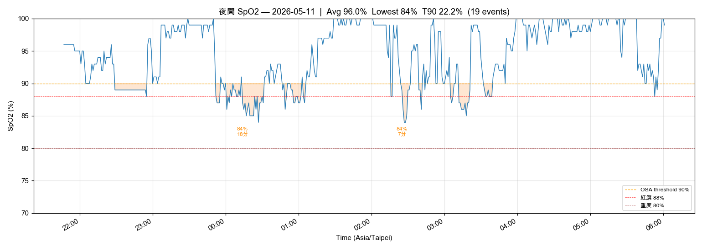
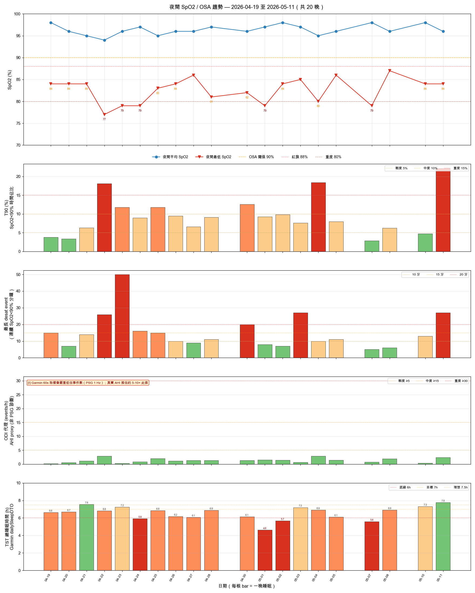
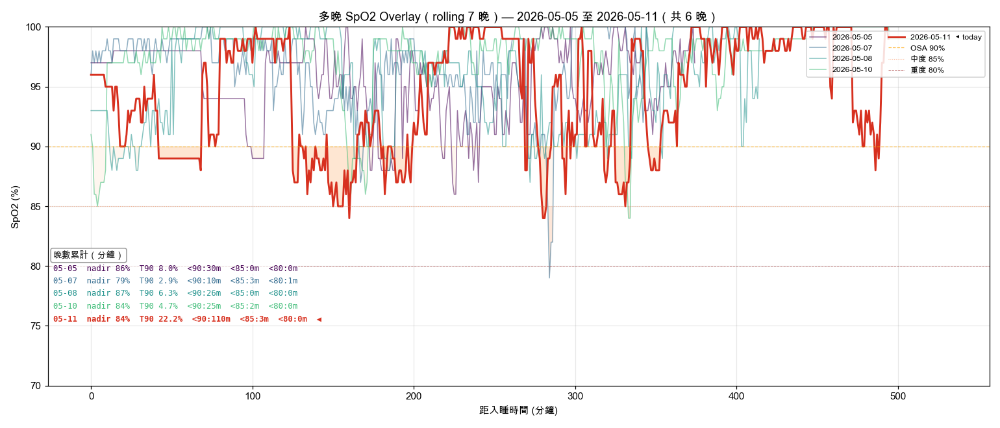

# 晨間健康紀錄 — 2026-05-11

*3 分鐘。起床後立即完成。記錄，不分析。*

---

## 體重

**今日：68.7 kg**
**體脂率：20.3 %**
**內臟脂肪等級：9.5**

*每週六早晨為正式紀錄（排尿後、進食前；連 5 個工作日後、週末大餐前的真實低點）。其他日可選填。*

---

## 血壓（晨間）

*起床後 1 小時內，上完廁所、進食前。坐下安靜 5 分鐘，連量兩次取第二次。*

| 次數 | 收縮壓 | 舒張壓 | 心率 |
|------|--------|--------|------|
| 第一次 | — | — | — |
| 第二次 | 126 | 74 | 68 |

---

## 睡眠狀態

**實際就寢：** 21:46
**實際起床：** 06:01
**中途醒來：** 無
**Garmin Sleep Score：** 79 / 100
**Garmin Body Battery 起床值：** 55
**主觀恢復感：** 3 / 5（1=極度疲憊, 5=精力充沛）

### SpO2 夜間最低（7 晚趨勢）

| 日期 | -6 | -5 | -4 | -3 | -2 | -1 | 今晨 |
|------|----|----|----|----|----|----|------|
| 日期 | 05-05 | 05-06 | 05-07 | 05-08 | 05-09 | 05-10 | 05-11 |
| 最低 % | 86 | 84 | 79 | 87 | — | 84 | 84 |

**今晨日均 SpO2：** 95%
**< 88% 連續晚數：** 7 晚中 6 晚（05-09 缺檔；今晚 T90 = 22.2% 為近期最差，總 desat 110 分鐘）→ **OSA 紅旗，強烈建議盡快安排 PSG**

**SpO2 全夜圖：** 
**SpO2 趨勢圖：** 
**SpO2 多晚 Overlay（rolling 7 晚）：** 

*Sleep Score < 65 或 Body Battery < 50 連續三天 → 重新檢視睡眠修復方案。*

---

## 昨日回顧

**實際飲水量：** 1.5 L（⚠️ 低於 2.0L，本週重點關注；目標 ≥ 2.5L；高尿酸最佳 2.8–3.0L；17:00 前完成 60-70%）

---

## 身體信號

*任何張力、疼痛、疲勞、異常 — 或「清」。記位置、性質、強度。*

| 部位 | 性質 | 強度 (0-10) |
|------|------|-------------|
| 雙肩 | 緊繃 | 3 |

---

## 今日計畫速記

- [ ] 飲水目標：2.5 L（17:00 前完成主要量）
- [ ] 補充品：洛神花茶 ×2 杯 + 魚油 ×2 + Vit D3K2 3000 IU + 酸櫻桃 500 mg + 鎂 400 mg + L-Citrulline 2 g + Psyllium husk 5 g ×2（鎂睡前 1-2 hr；D3K2 / Citrulline 晨間隨脂肪餐；Psyllium 午/晚餐前 30 min）
- [ ] 運動：依預設計畫
- [ ] 活動度/伸展：雙肩活動度（門框胸肌伸展、肩胛上下繞環、頸後伸）2 組 ×30 秒

---

💡 PT 建議：雙肩緊繃強度 3 — 多為前傾姿勢累積，午後做 2 分鐘門框伸展 + 肩胛後縮 ×15 即可緩解；若連 3 天非「清」再評估。SpO2 連續紅旗為今日最高優先，請本週內預約 PSG。

---

*Filed: reviews/daily/2026-05-11.md*
