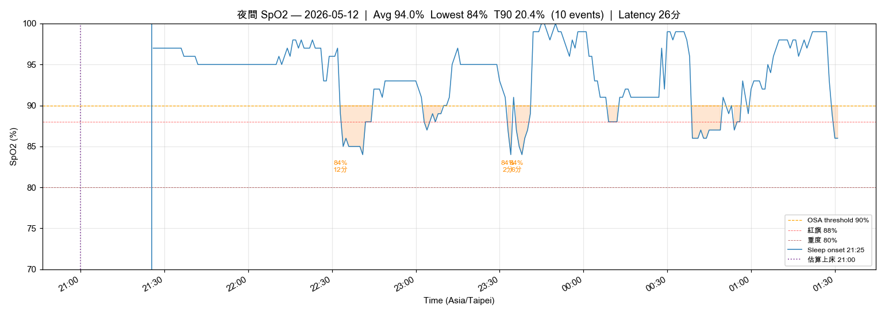
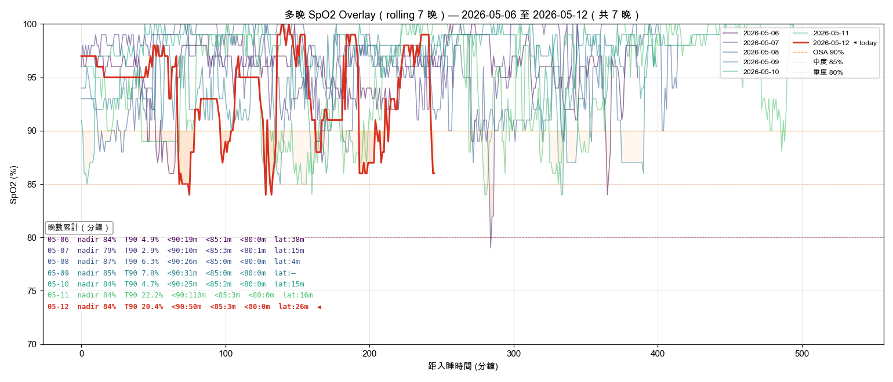

# 晨間健康紀錄 — 2026-05-12

*3 分鐘。起床後立即完成。記錄，不分析。*

---

## 體重

**今日：68.5 kg**
**體脂率：20.5 %**
**內臟脂肪等級：9.5**

*每週六早晨為正式紀錄（排尿後、進食前；連 5 個工作日後、週末大餐前的真實低點）。其他日可選填。*

---

## 血壓（晨間）

*起床後 1 小時內，上完廁所、進食前。坐下安靜 5 分鐘，連量兩次取第二次。*

| 次數 | 收縮壓 | 舒張壓 | 心率 |
|------|--------|--------|------|
| 第一次 | — | — | — |
| 第二次 | 131 | 75 | 70 |

---

## 睡眠狀態

**Garmin 偵測入睡：** 21:25
**實際起床：** 01:31
**中途醒來：** 無（但總時長僅 4h 4m，提早起床）
**Garmin Sleep Score：** 44 / 100 ⚠️（極低）
**Garmin Body Battery 起床值：** 36 ⚠️（< 50）
**主觀恢復感：** 2 / 5（疲憊）
**深眠：** 72 分｜**REM：** 0 分 ⚠️（REM 缺失，常見於提早覺醒或睡眠片段化）

### SpO2 夜間最低（7 晚趨勢）

| 日期 | -6 | -5 | -4 | -3 | -2 | -1 | 今晨 |
|------|----|----|----|----|----|----|------|
| 日期 | 05-06 | 05-07 | 05-08 | 05-09 | 05-10 | 05-11 | 05-12 |
| 最低 % | 84 | 79 | 87 | 85 | 84 | 84 | 86 |

**今晨日均 SpO2：** 96%
**< 88% 連續晚數：** **7/7 晚** → **OSA 紅旗，請本週內預約 PSG**（24 晚累計 100% 低於 88%；今晨 T90 = 20.4%、總 desat 50 分鐘）

**SpO2 全夜圖：** 
**SpO2 趨勢圖：** 
**SpO2 多晚 Overlay（rolling 7 晚）：** 

*Sleep Score 44 + Body Battery 36 + REM 0 + 總時長 4h — 此夜為近期最差組合；今日避免咖啡因晚於 12:00，傍晚補一段 20-30 min nap（< 30 min 不影響夜間入睡），晚上嚴格 21:30 上床。*

---

## 昨日回顧

**實際飲水量：** 0.9 L ⚠️（連 2 天 < 2.0L — 本週重點關注；高尿酸最佳 2.8–3.0L）
**昨日活動消耗：** 317 kcal（主動 277 + BMR 40；騎車 ×2 + meditation 10 分）
  - 在 100-300 kcal 區間 → 今日維持原計畫
**昨日 Na / K / Na-K ratio：** 未紀錄（無 food log）

---

## 身體信號

*任何張力、疼痛、疲勞、異常 — 或「清」。記位置、性質、強度。*

| 部位 | 性質 | 強度 (0-10) |
|------|------|-------------|
| 雙腳 | 痠 | 3 |
| 雙肩 | 緊繃 | 3 |

---

## 今日計畫速記（對齊 2026-03-25 supplement-guide §7 錨點化時程）

**水分總量目標：2.8 L**｜咖啡因截止 13:00｜液體截止 20:00｜固體截止 19:30

- [ ] **05:45 起床**：床頭 500 mL 溫水 + 陽台 5-10 min 自然光 + BP 測量（昨日已過此時段，明日起執行）
- [ ] **06:00 早餐**：優格 + whey 30 g + 堅果 30 g + L-Citrulline 4 g + D3 2000 IU + K2 MK-7 180 mcg + 益生菌
  - K 升級項（Week 1 起步先加香蕉）：香蕉 1 整根（+422 mg K）
- [ ] **06:30 通勤前**：洛神花茶 #1（保溫瓶）｜NAC ⏸️ 待 PSG
- [ ] **09:30 ★ 水分校驗 ≥ 1.0 L**｜雙肩門框胸肌伸展 30 秒
- [ ] **11:30 午餐前 30 min**：Psyllium 5 g + 350 mL 水 + 1 分 box breathing
- [ ] **12:00 午餐（自帶）**：地瓜 150 g + 白煮蛋 ×2（取代茶葉蛋）+ 自帶毛豆 120 g + 菇蕈沙拉 30-50 g + 自泡抹茶拿鐵 400 mL（**13:00 前喝完**）
- [ ] **13:30 洛神花 #2**（截止 14:00）｜★ 水分 ≥ 2.0 L
- [ ] **15:30 下午點心**：南瓜籽仁 30 g + 250 mL 水
- [ ] **17:00 ★ 運動**：今日改低衝擊 Zone 2 騎車或快走 30 min（雙腳痠 3/10）｜★ 水分達 2.5 L
- [ ] **18:00 晚餐前 30 min**：Psyllium 5 g + 350 mL 水
- [ ] **18:30 晚餐**：清蒸魚 / 白肉雞 + 菇蕈 50-80 g（達日總 100-130 g）+ 餐後魚油 ×2
- [ ] **19:30**：魚油 ×2（剩餘）
- [ ] **20:00 ★ Wind-down**：燈光 < 50 lux + 螢幕濾鏡｜**液體截止**
- [ ] **20:30**：雙肩 + 髖屈肌 stretch 5 分 + 雙腳小腿牆推 ×30 秒
- [ ] **21:00 睡前 stack**：鎂甘胺酸 400 mg + 酸櫻桃 1000-2000 mg + Glycine 3 g（起步 1.5 g × 3 晚試耐受）
- [ ] **21:30 上床（紙本/Kindle 暖光）｜22:00 熄燈**（補昨夜 TST 不足，目標 latency < 15 min）

---

💡 PT 建議：今夜為近期最差睡眠（Sleep Score 44 / REM 0 / 僅 4h），加上 SpO2 連 7 晚 < 88%，**本週內務必預約 PSG**。雙腳痠 + 雙肩緊強度 3 屬可控範圍，今日避免高衝擊，改低衝擊 Zone 2；飲水昨日僅 0.9L 已連 2 天 < 2.0L，今日早午前完成 1.5L 為硬指標。

---

*Filed: reviews/daily/2026-05-12.md*
