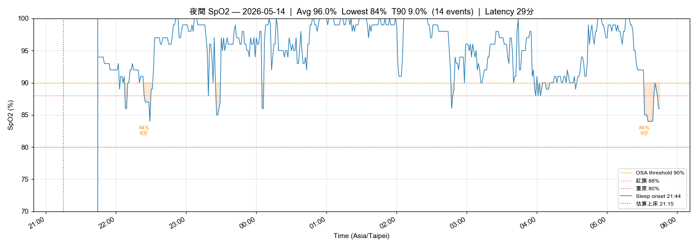
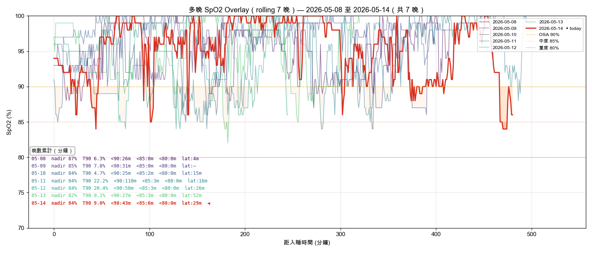

# 晨間健康紀錄 — 2026-05-14

*3 分鐘。起床後立即完成。記錄，不分析。*

---

## 體重

**今日：67.9 kg**
**體脂率：19.6 %**
**內臟脂肪等級：9.5**

*每週六早晨為正式紀錄（排尿後、進食前；連 5 個工作日後、週末大餐前的真實低點）。其他日可選填。*

*停滯解鎖：vs 5/13 的 68.3 kg → −0.4 kg；體脂率 20.5% → 19.6%（−0.9%）。*

---

## 血壓（晨間）

*起床後 1 小時內，上完廁所、進食前。坐下安靜 5 分鐘，連量兩次取第二次。*

| 次數 | 收縮壓 | 舒張壓 | 心率 |
|------|--------|--------|------|
| 第一次 | — | — | — |
| 第二次 | 125 | 70 | 70 |

---

## 睡眠狀態

**Garmin 偵測入睡：** 21:44
**實際上床：**
**實際起床：** 05:45
**中途醒來：** 2 次以上
**Garmin Sleep Score：** 67 / 100
**Garmin Body Battery 起床值：** 34
**主觀恢復感：** 3 / 5（普通）
**入睡 latency：** 自動估算

### SpO2 夜間最低（7 晚趨勢）

| 日期 | -6 | -5 | -4 | -3 | -2 | -1 | 今晨 |
|------|----|----|----|----|----|----|------|
| 日期 | 05-08 | 05-09 | 05-10 | 05-11 | 05-12 | 05-13 | 05-14 |
| 最低 % | 87 | 85 | 84 | 84 | 84 | 82 | 84 |

**今晨日均 SpO2：** 96%
**< 88% 連續晚數：** 7（OSA 紅旗門檻：連 3 晚 < 88% → 強烈建議 PSG）

**SpO2 全夜圖：** 
**SpO2 趨勢圖：** 
**SpO2 多晚 Overlay（rolling 7 晚）：** 

*Sleep Score < 65 或 Body Battery < 50 連續三天 → 重新檢視睡眠修復方案。*

---

## 昨日回顧

**實際飲水量：** 2.00 L（目標 ≥ 2.5L；高尿酸最佳 2.8–3.0L；17:00 前完成 60-70%）— 達標
**昨日活動消耗：** 132 kcal（主動 56 + BMR；僅 1 段 6 min 騎車）— **顯著偏低（< 300 kcal）**，今日加強運動
**昨日 Na / K / Na-K ratio：** — / — / —（飲食檔未填）

---

## 身體信號

*任何張力、疼痛、疲勞、異常 — 或「清」。記位置、性質、強度。*

| 部位 | 性質 | 強度 (0-10) |
|------|------|-------------|
| 清 | — | — |

---

## 今日計畫速記

- [ ] 飲水目標：3.0 L（錨點 09:30 ≥1.0L / 13:30 ≥2.0L / 17:00 截止 2.5L）
- [ ] 補充品（核心，2026-05-11 v2）：
  - 早餐（06:00）：D3 3000 IU + K2 MK-7 180 mcg（**翻包裝確認單位**）+ L-Citrulline **4 g**（對齊每日 4 g）+ 益生菌
  - **抹茶 5 g 改於 06:30 空腹（與早餐間隔 30 min，避開咖啡因午後殘餘）**
  - 午餐前 30 min：Psyllium 5 g + 300 mL 水
  - 晚餐前 30 min：Psyllium 5 g + 300 mL 水
  - **18:00 高鐵點心**：茶葉蛋 1 顆 + 統一陽光無糖豆漿 380 mL（200 kcal / 20 g 蛋白）
  - 晚餐後：魚油 ×4（拆 18:30 ×2 + 19:30 ×2）
  - 睡前（21:00）：鎂甘胺酸 400 mg + 酸櫻桃 1000-2000 mg + Glycine 純粉 3 g
  - 茶飲：洛神花 ×2 杯（早 + 14:00 前）
  - 食物層：南瓜籽 30 g（15:30）+ 菇蕈 100-130 g/天
- [ ] **晚餐便當紫米/糙米減半**（點餐時直接講「飯減半」）
- [ ] **餐後 20:00 散步 10-15 min**（餐後血糖搬運 + AHI 緩衝）
- [ ] 運動（17:00 固定）：依排程執行；昨日活動 < 100 kcal，今日不可再缺
- [ ] 活動度/伸展（09:30 + 20:30 兩次錨點）
- [ ] Wind-down（20:00 燈光降 + 螢幕濾鏡，液體截止）
- [ ] 上床 21:30 / 熄燈 22:00（TST 目標 7h+）

---

### 💡 PT 建議

1. **體重停滯解鎖**：67.9 kg（−0.4 kg）+ 體脂 −0.9% — 昨日討論的「便當飯減半」策略尚未實施，今日為首戰，重點觀察晚餐執行度。
2. **OSA 紅旗第 26 晚**：SpO2 < 88% 連 7 晚不動（今晨 nadir 84%、6 min < 85%），疊加 RHR 上升 58→58→60 + BB 起床 34、**多次中途醒** — PSG 已不可再延，務必本週敲定。
3. **昨日活動 132 kcal 偏低**：5/13 僅 6 min 騎車，今日 17:00 運動必須執行（含 Z2 心率 133-146 區間 30 min+）。
4. **BP 125/70**：穩定範圍，趨勢延續。

---

*Filed: reviews/daily/2026-05-14.md*
