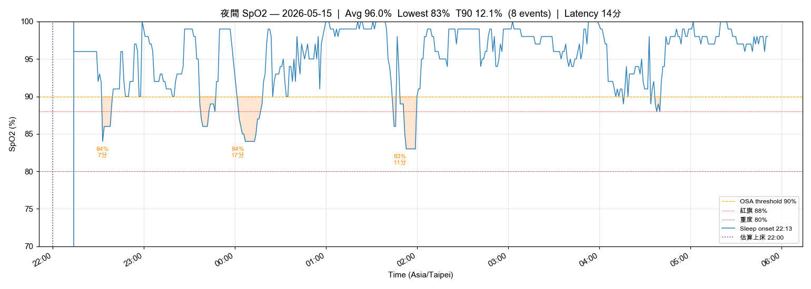
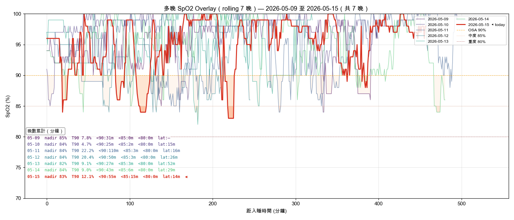

# 晨間健康紀錄 — 2026-05-15

*3 分鐘。起床後立即完成。記錄，不分析。*

---

## 體重

**今日：67.3 kg**
**體脂率：19.5 %**
**內臟脂肪等級：9.0**

*每週六早晨為正式紀錄（排尿後、進食前；連 5 個工作日後、週末大餐前的真實低點）。其他日可選填。*

*三項齊降：vs 5/14 67.9 kg / 19.6% / 9.5 → −0.6 kg / −0.1% / −0.5 VFL。本週首次體脂破 20% 門檻，明日（5/16 週六）為正式週記錄。*

---

## 血壓（晨間）

*起床後 1 小時內，上完廁所、進食前。坐下安靜 5 分鐘，連量兩次取第二次。*

| 次數 | 收縮壓 | 舒張壓 | 心率 |
|------|--------|--------|------|
| 第一次 | — | — | — |
| 第二次 | 122 | 69 | 70 |

---

## 睡眠狀態

**Garmin 偵測入睡：** 22:13
**實際上床：**
**實際起床：** 05:51
**總睡眠時長：** 6h 33m
**深眠：** 113 分｜**REM：** 88 分
**中途醒來：** 2 次（小孩夜奶）
**Garmin Sleep Score：** 74 / 100
**Garmin Body Battery 起床值：** 51
**主觀恢復感：** 2 / 5（中途醒打斷恢復）
**入睡 latency：** 自動估算

### SpO2 夜間最低（7 晚趨勢）

| 日期 | -6 | -5 | -4 | -3 | -2 | -1 | 今晨 |
|------|----|----|----|----|----|----|------|
| 日期 | 05-09 | 05-10 | 05-11 | 05-12 | 05-13 | 05-14 | 05-15 |
| 最低 % | 85 | 84 | 84 | 86 | 82 | 84 | 83 |

**今晨日均 SpO2：** 96%
**< 88% 連續晚數：** 10（OSA 紅旗門檻：連 3 晚 < 88% → 強烈建議 PSG）

**SpO2 全夜圖：** 
**SpO2 趨勢圖：** 
**SpO2 多晚 Overlay（rolling 7 晚）：** 

*Sleep Score 74 + BB 51 為近期最佳組合（雖中途醒 2 次），但 SpO2 nadir 83% 連 10 晚未改善 — 結構性 OSA 問題不會自行緩解。*

---

## 昨日回顧

**實際飲水量：** 1.20 L ⚠️（連 4 天 < 2.5L，連 1 天 < 2.0L 之後反彈，本週仍未達標）
**昨日活動消耗：** 295 kcal（主動 223 + BMR；4 段 walking 3.53 km / 53.6 min）+ 步數 14,274 — ✅ 顯著回升（vs 5/13 132 kcal）
**昨日 Na / K / Na-K ratio：** — / — / —（飲食檔未填）

---

## 身體信號

*任何張力、疼痛、疲勞、異常 — 或「清」。記位置、性質、強度。*

| 部位 | 性質 | 強度 (0-10) |
|------|------|-------------|
| 清 | — | — |

---

## 今日計畫速記

- [ ] 飲水目標：2.8 L（錨點 09:30 ≥1.0L / 13:30 ≥2.0L / 17:00 截止 2.5L）
- [ ] 補充品（核心，2026-05-11 v2）：
  - 早餐（06:00）：D3 3000 IU + K2 MK-7 180 mcg + L-Citrulline 4 g + 益生菌
  - 抹茶 5 g 06:30 空腹（與早餐間隔 30 min）
  - 午餐前 30 min：Psyllium 5 g + 300 mL 水（獨立計量，不計入 2.8L 目標）
  - 晚餐前 30 min：Psyllium 5 g + 300 mL 水（獨立計量）
  - **18:00 點心改版**：**白煮蛋 ×2 + 無糖豆漿 380 mL**（取代茶葉蛋，Na 從 440 → 140 mg、Na/K ratio 1.47 → 0.29）
  - 晚餐後：魚油 ×4（拆 18:30 ×2 + 19:30 ×2）
  - 睡前（21:00）：鎂甘胺酸 400 mg + 酸櫻桃 1000-2000 mg + Glycine 純粉 3 g
  - 茶飲：洛神花 ×2 杯（早 + 14:00 前）
  - 食物層：南瓜籽 30 g（15:30）+ 菇蕈 100-130 g/天
- [ ] **晚餐便當紫米/糙米減半**（點餐時直接講「飯減半」）
- [ ] **餐後 20:00 散步 10-15 min**（餐後血糖搬運 + AHI 緩衝）
- [ ] 運動（17:00 固定）：Zone 2 心率 133-146 區間 30 min+
- [ ] 活動度/伸展（09:30 + 20:30 兩次錨點）
- [ ] Wind-down（20:00 燈光降 + 螢幕濾鏡，液體截止）
- [ ] 上床 21:30 / 熄燈 22:00（TST 目標 7h+，補昨夜中途醒落差）

---

### 💡 PT 建議

1. **體重三項齊降**：67.3 kg（−0.6）+ 體脂 19.5%（首破 20% 門檻）+ VFL 9.0（首見個位數整數） — 5/14「便當飯減半」+ 步數 14,274 + 4 段 walking 53.6 min 三項組合奏效，明日 5/16 週六正式紀錄為關鍵驗證點。
2. **OSA 第 27 晚紅旗**：SpO2 < 88% 連 10 晚（今晨 nadir 83%），雖然 Sleep Score 74 / REM 88 分 / BB 51 為近期最佳，**結構性問題未解** — PSG 預約進度為本週最高優先，請今日致電預約。
3. **昨日飲水 1.20 L 連 4 天偏低**：今日 09:30 必達 1.0L 為硬指標；高尿酸 baseline 戒果糖後首檢（7 月）前，飲水是僅次於 OSA 的核心變數。
4. **小孩夜奶 2 次打斷**：主觀恢復感 2/5 即使在 Garmin 客觀數據良好下仍偏低 — 今晚提早上床 21:30（非 22:00），預期被打斷後仍能保 6.5h 淨睡眠。
5. **BP 122/69**：穩定範圍，趨勢延續達標。

---

*Filed: reviews/daily/2026-05-15.md*
