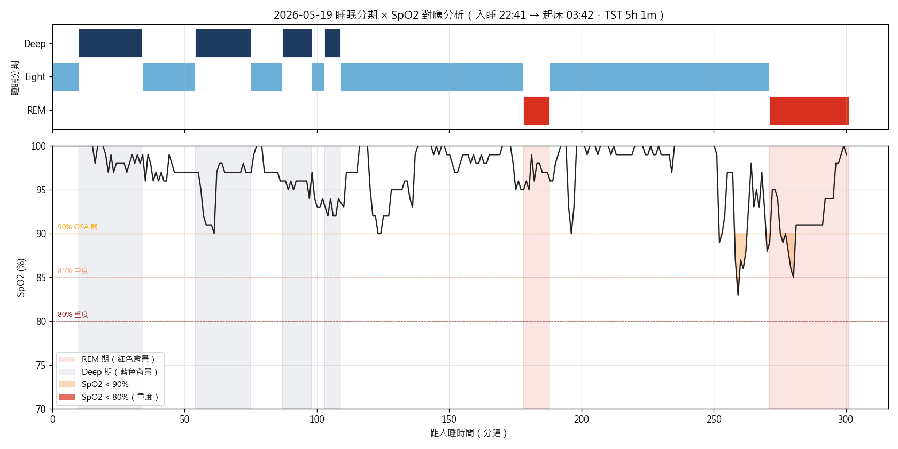
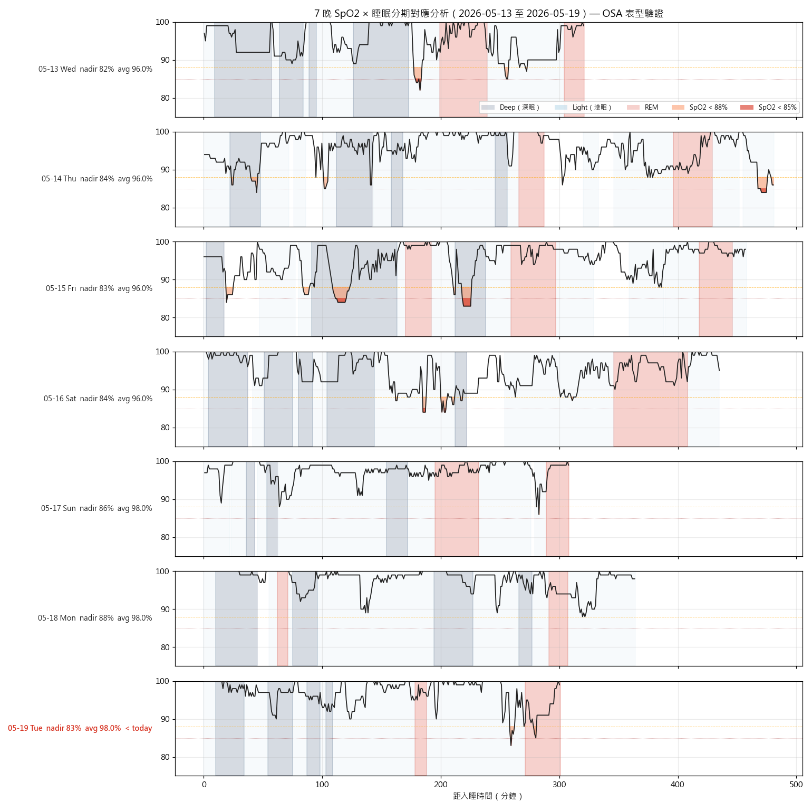
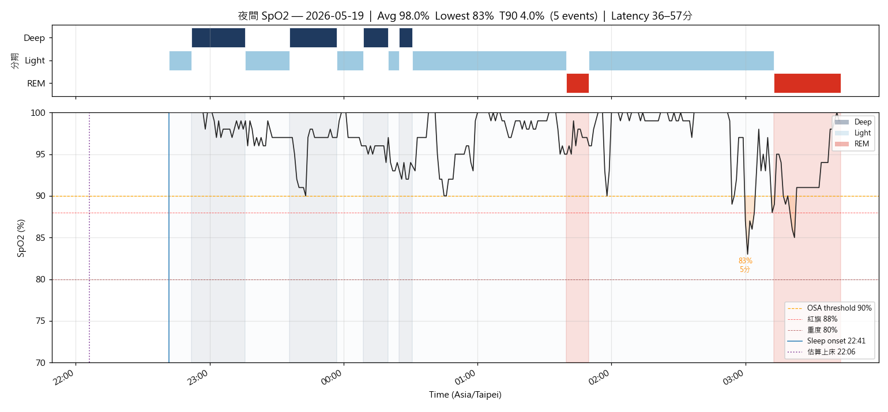
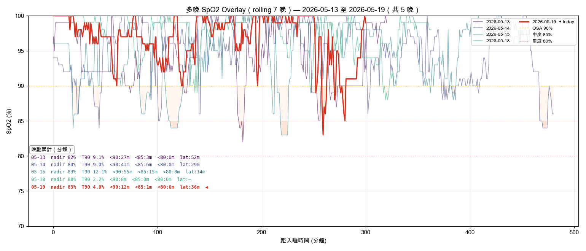

# 晨間健康紀錄 — 2026-05-19

*3 分鐘。起床後立即完成。記錄，不分析。*

---

## 體重

**今日：68.6 kg**
**體脂率：19.6 %**
**內臟脂肪等級：9.5**

*每週六早晨為正式紀錄（排尿後、進食前；連 5 個工作日後、週末大餐前的真實低點）。其他日可選填。*

*vs 5/15 67.3 kg / 19.5% / 9.0 → +1.3 kg / +0.1% / +0.5 VFL（5/16-5/18 三日空窗，反彈訊號明顯，週末未控制）。本週六 5/23 正式紀錄為下一驗證點。*

---

## 血壓（晨間）

*起床後 1 小時內，上完廁所、進食前。坐下安靜 5 分鐘，連量兩次取第二次。*

| 次數 | 收縮壓 | 舒張壓 | 心率 |
|------|--------|--------|------|
| 第一次 | — | — | — |
| 第二次 | — | — | — |

*今日未測量。*

---

## 睡眠狀態

**Garmin 偵測入睡：** 22:41
**實際上床：**
**實際起床：** 03:42
**總睡眠時長：** 5h 1m
**深眠：** 62 分｜**REM：** 40 分
**中途醒來：** 0 次
**Garmin Sleep Score：** 64 / 100
**Garmin Body Battery 起床值：** 62
**主觀恢復感：** 3 / 5
**入睡 latency：** 自動估算

### SpO2 夜間最低（7 晚趨勢）

| 日期 | -6 | -5 | -4 | -3 | -2 | -1 | 今晨 |
|------|----|----|----|----|----|----|------|
| 日期 | 05-13 | 05-14 | 05-15 | 05-16 | 05-17 | 05-18 | 05-19 |
| 最低 % | 82 | 84 | 83 | 84 | 86 | 87 | 83 |
| T90 % | 9.1 | 9.0 | 12.1 | 14.7 | 1.6 | 2.2 | 4.0 |

*5/17 = 5/16→5/17 夜（日月潭家庭旅遊夜，海拔 ~750m）；5/16 = 5/15→5/16 夜（出發前家中）。Garmin calendarDate 以「起床日」歸檔。*

**今晨日均 SpO2：** 96%
**< 88% 連續晚數：** ≥ 14（5/13–5/19 連續 7 晚全部 < 88%；OSA 紅旗門檻已超 4 倍）

### 7 晚 stage-stratified SpO2 + HRV 同步分析（2026-05-19）

| 階段 | Epoch 數 | 均值 | 最低 | < 90% 比例 |
|------|----------|------|------|------------|
| Deep（深眠） | 62 | 96.6% | 90% | 0.0% |
| Light（淺眠） | 198 | 97.4% | 83% | 3.5% |
| **REM** | **40** | **93.5%** | **85%** | **12.5%** |

**HRV：24 ms（14 晚新高，baseline 18-20 ms，+20%）**；HRV ↑ + SpO2 nadir 83% 解耦提示 arousal threshold 偏高。但 7 晚 stage 分層分析顯示**主導 desat 階段在 Light/Deep/REM 之間漂移**（5/13 Light dominant、5/15 Deep dominant 28%、5/19 REM dominant 12.5%），**並非純 REM-OSA**，先前單晚結論需修正為「混合型 OSA + 高 arousal threshold」。

**HRV 24 ms 上升解讀**：5/17 日月潭夜 HRV 18 ms（7 晚最低）+ 返家 5/18 22 ms + 5/19 24 ms — 是**旅遊壓力撤除後副交感反彈（rebound）**，非新 baseline；預期 2-3 晚回落至 19-22。

**5/15 Deep 期 < 90% 達 28%** 是強烈結構性訊號（深眠肌張力足夠仍 desat → 鼻甲 / 鼻中膈 / 咽腔狹窄為解剖因子）。PSG 預約時請醫師：(1) 計算 REM AHI vs NREM AHI 比值與 arousal index；(2) 評估上呼吸道解剖（Mallampati、扁桃腺、鼻內視鏡）。

**睡眠分期 × SpO2 對應圖（5/19 單晚）：** 
**7 晚 SpO2 × 睡眠分期疊圖：** 

**SpO2 全夜圖：** 
**SpO2 趨勢圖：** 
**SpO2 多晚 Overlay（rolling 7 晚）：** 

*起床時間 03:42 / 總時長 5h 1m — TST 嚴重不足；雖中途醒 0 次且 BB 62 為近期高點，但 SpO2 nadir 83% + TST < 6h 為複合風險。*

---

## 昨日回顧

**實際飲水量：** 1.5 L ⚠️（連續低於 2.5L 目標；已回寫 Garmin Connect）
**昨日活動消耗：** —（5/18 Garmin daily summary 未列活動段）
**昨日步數：** 9,473
**昨日 Na / K / Na-K ratio：** — / — / —（5/18 飲食檔未填）

---

## 身體信號

*任何張力、疼痛、疲勞、異常 — 或「清」。記位置、性質、強度。*

| 部位 | 性質 | 強度 (0-10) |
|------|------|-------------|
| 清 | — | — |

---

## 今日計畫速記

- [ ] 飲水目標：2.8 L（錨點 09:30 ≥1.0L / 13:30 ≥2.0L / 17:00 截止 2.5L）
- [ ] 補充品（核心，2026-05-11 v2）：
  - 早餐（06:00）：D3 3000 IU + K2 MK-7 180 mcg + L-Citrulline 4 g + 益生菌
  - 抹茶 5 g 06:30 空腹
  - 午餐前 30 min：Psyllium 5 g + 300 mL 水
  - 晚餐前 30 min：Psyllium 5 g + 300 mL 水
  - 18:00 點心：白煮蛋 ×2 + 無糖豆漿 380 mL
  - 晚餐後：魚油 ×4（拆 18:30 ×2 + 19:30 ×2）
  - 睡前（21:00）：鎂甘胺酸 400 mg + 酸櫻桃 1000-2000 mg + Glycine 3 g
  - 茶飲：洛神花 ×2 杯（早 + 14:00 前）
  - 食物層：南瓜籽 30 g（15:30）+ 菇蕈 100-130 g/天
- [ ] 飲食：預設菜單（便當飯減半，晚餐 20:00 後不再進食）
- [ ] 運動：餐後散步 15 min ×2（午 / 晚），預設模式
- [ ] 活動度/伸展（09:30 + 20:30 兩次錨點）
- [ ] Wind-down（20:00 燈光降 + 螢幕濾鏡，液體截止）
- [ ] 上床 21:30 / 熄燈 22:00（TST 目標 7h+）

---

### 💡 PT 建議

1. **體重三項齊升（5/15 → 5/19）**：67.3 → 68.6 kg（+1.3 kg）/ 體脂 19.5 → 19.6% / VFL 9.0 → 9.5 — 5/16-5/18 空窗期反彈明顯，週末未控制是主因；本週六 5/23 為下一正式紀錄點，今日起回到「飯減半 + 餐後散步」雙錨點。
2. **OSA 第 14 晚以上紅旗 + 表型確認**：SpO2 nadir 83% 連 7 晚 < 88%（含日月潭海拔夜 5/16 nadir 84% 與返家 5/17 nadir 86%），HRV ↑ + 缺氧解耦定位為**高閾值 REM-related OSA**；PSG 預約若尚未完成，本週剩餘 4 個工作日內必須敲定 — 此為當前所有指標中最高優先級。CPAP 預期反應率 > 80%。
3. **血壓今日未測**：請至少明日（5/20）恢復連續紀錄，週二是 weekly trend 校準的中段關鍵點。
4. **昨日飲水 1.5L 偏低**：今日 09:30 必達 1.0L 為硬指標，13:30 ≥ 2.0L 為第二錨點；高尿酸 baseline 加上夜間 SpO2 desats（缺氧增加 UA 生成）使飲水成為僅次於 OSA 的核心變數。
5. **身體信號清 + 主觀恢復 3/5**：客觀數據（Sleep Score 64 / BB 62）與主觀感受對齊，但 5h 1m TST 在「沒中醒」前提下仍只能達到 3/5 — 系統性訊號指向 OSA 通氣品質才是天花板。
6. **連續兩天 EMA（Early Morning Awakening）警示**：5/18 起床 03:24（TST 5h 54m，REM 僅 25 分鐘）+ 5/19 起床 03:42（TST 5h 1m）— 比 5/13-5/16 baseline 起床 05:00-06:00 提前 1.5-2.5 小時，REM 嚴重壓縮。鑑別診斷涵蓋皮質醇覺醒反應提前、phase advance、sub-clinical depression、OSA 中段覺醒鞏固。**今晚介入**：(1) 若 03:30-04:30 自然醒，側躺不開燈不下床 30 分鐘嘗試回睡；(2) 起床後不立即接觸強光；(3) 5/20 daily 觀察 REM，若仍 < 60 分鐘為高度警示，若 > 80 分鐘為 REM rebound（短期可接受）；(4) 連 3 天 EMA + 主觀情緒持續 < 3 → 心身科 / 家醫科評估（EMA 是 melancholic depression 最敏感的早期單一指標）。

---

*Filed: reviews/daily/2026-05-19.md*
