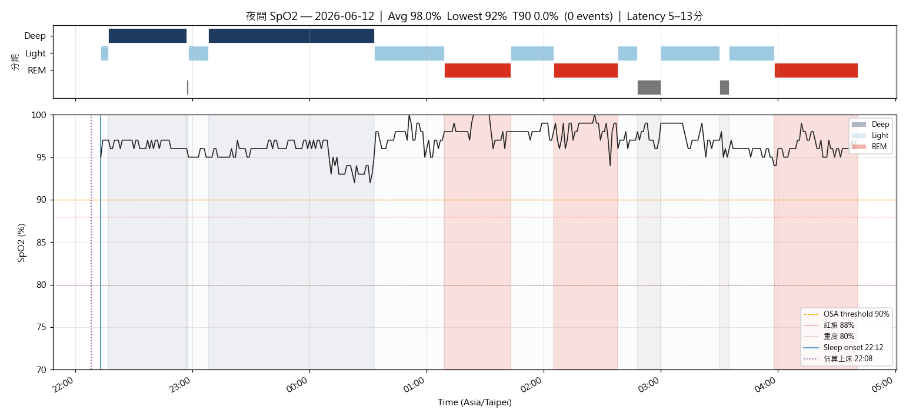
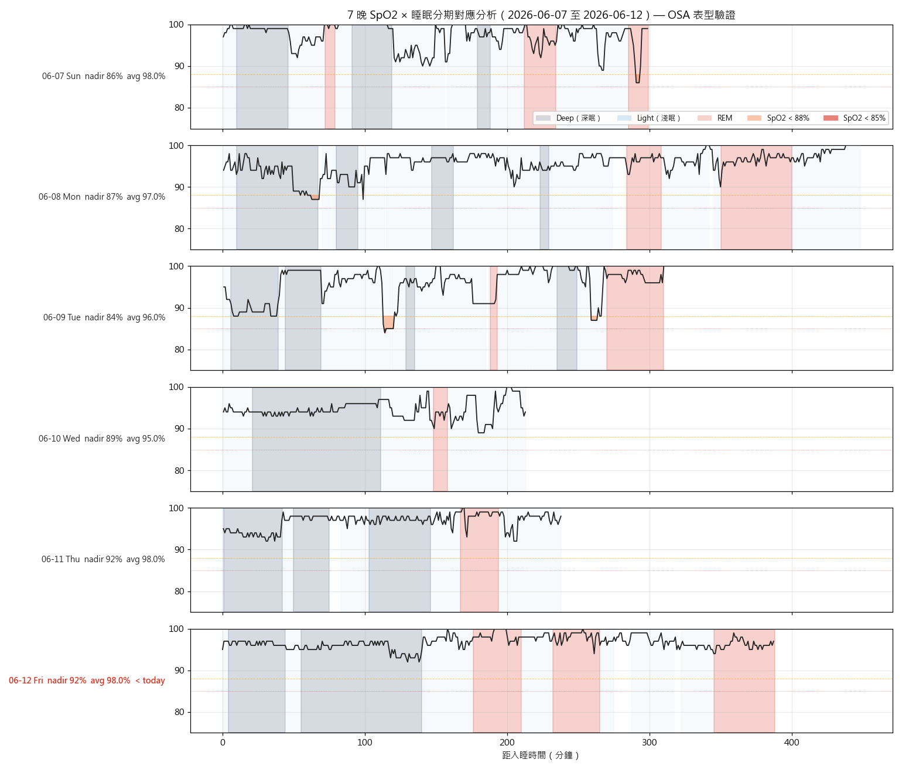

# 晨間健康紀錄 — 2026-06-12

*3 分鐘。起床後立即完成。記錄，不分析。*

---

## 體重 / 體組成

**今日：66.5 kg**
**體脂率：19.4 %**
**內臟脂肪等級：9.0**
**腰圍 (WHO midpoint)：— cm**（最下肋骨下緣 + 髂嵴頂端兩點水平中點環繞，通常在肚臍上方 2-5 cm；**與健檢歷史可比**；目標維持 ≤ 83、推進至 < 80 cm）
**腰圍 (最大腹圍)：— cm**（自然站立、吐氣末、不收腹，軟尺上下移動找最大讀數；通常在肚臍 0 至 -4 cm；**對內臟脂肪變化最敏感**）

*每週六早晨為正式體重紀錄（排尿後、進食前；連 5 個工作日後、週末大餐前的真實低點）。其他日可選填。*

---

## 血壓（晨間）

*起床後 1 小時內，上完廁所、進食前。坐下安靜 5 分鐘，連量兩次取第二次。*

| 次數 | 收縮壓 | 舒張壓 | 心率 |
|------|--------|--------|------|
| 第一次 | — | — | — |
| 第二次 | — | — | — |

*今日未量（N/A）。*

---

## 睡眠狀態

**Garmin 偵測入睡：** 22:12
**實際起床：** 04:40
**中途醒來：** 次數：1 / 原因：上廁所
**Garmin Sleep Score：** 78 / 100
**Garmin Body Battery 起床值：** 54
**主觀恢復感：** 3 / 5（1=極度疲憊, 5=精力充沛）
**總時長：** 6h 10m（深眠 125 分｜REM 110 分）

### SpO2 夜間最低（7 晚趨勢）

| 日期 | -6 | -5 | -4 | -3 | -2 | -1 | 今晨 |
|------|----|----|----|----|----|----|------|
| 日期 | 06-06 | 06-07 | 06-08 | 06-09 | 06-10 | 06-11 | 06-12 |
| 最低 % | 85 | 86 | 84 | 87 | 87 | 91 | 88 |

**今晨日均 SpO2：** 97%
**< 88% 連續晚數：** 0（今晨 88% 剛好在門檻線上，未低於 88；7 晚內 5 晚 < 88%）
**Stage 分層：** 今晚 Deep/Light/REM nadir 92/95/94%，<90% 占比皆 0% — 全夜結構為本週最佳

**SpO2 全夜圖（含 hypnogram 條帶）：** 
**SpO2 趨勢圖：** 
**SpO2 全夜 Heatmap（46 晚 Venu 4 cohort）：** 
**SpO2 × 睡眠分期 7 晚疊圖：** 

*Sleep Score < 65 或 Body Battery < 50 連續三天 → 重新檢視睡眠修復方案。*

---

## 昨日回顧

**實際飲水量：** 2.50 L（目標 ≥ 2.5L；高尿酸最佳 2.8–3.0L；17:00 前完成 60-70%）— 達標 ✅（Garmin 原漏記 1.2L，使用者口頭更正，已以 log_hydration.py 回寫 +1300 mL）
**昨日活動消耗：** 214 kcal（主動 175 + BMR；步數 10,633）
**昨日 Na / K / Na-K ratio：** —（無飲食紀錄）

---

## 身體信號

*任何張力、疼痛、疲勞、異常 — 或「清」。記位置、性質、強度。*

| 部位 | 性質 | 強度 (0-10) |
|------|------|-------------|
| — | 清 | 0 |

---

## 今日計畫速記

- [ ] 飲水目標：2.5 L（錨點 09:30 ≥1.0L / 13:30 ≥2.0L / 17:00 截止 2.5L）
- [ ] 補充品（核心，2026-05-11 v2）：
  - 早餐：D3 2000 IU + K2 MK-7 180 mcg + L-Citrulline 4 g + 益生菌
  - 午餐前 30 min：Psyllium 5 g + 350 mL 水
  - 晚餐前 30 min：Psyllium 5 g + 350 mL 水
  - 晚餐後：魚油 ×4（拆 18:30 ×2 + 19:30 ×2）
  - 睡前：鎂甘胺酸 400 mg + 酸櫻桃 1000-2000 mg + Glycine 純粉 3 g
  - 茶飲：洛神花 ×2 杯（早 + 14:00 前）
- [ ] 運動（17:00 固定）：照常（走路 walk as default）+ 晨間騎乘 5.7 min 已完成
- [ ] 活動度/伸展（09:30 + 20:30 兩次錨點）：照常
- [ ] Wind-down（20:00 燈光降 + 螢幕濾鏡，液體截止）
- [ ] 上床 21:30 / 熄燈 22:00（TST 目標 7h+）

---

*Filed: reviews/daily/2026-06-12.md*
