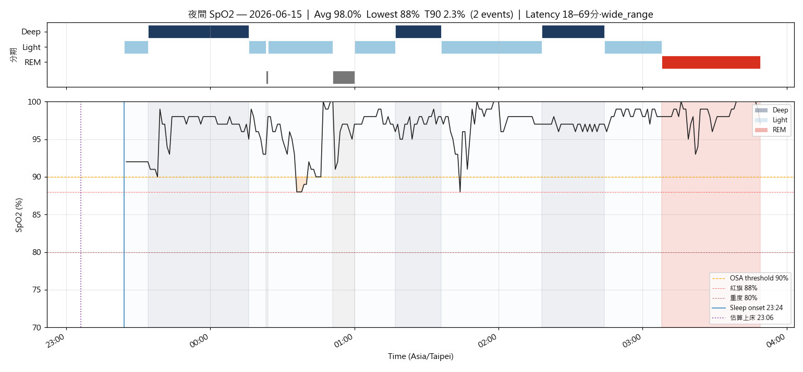
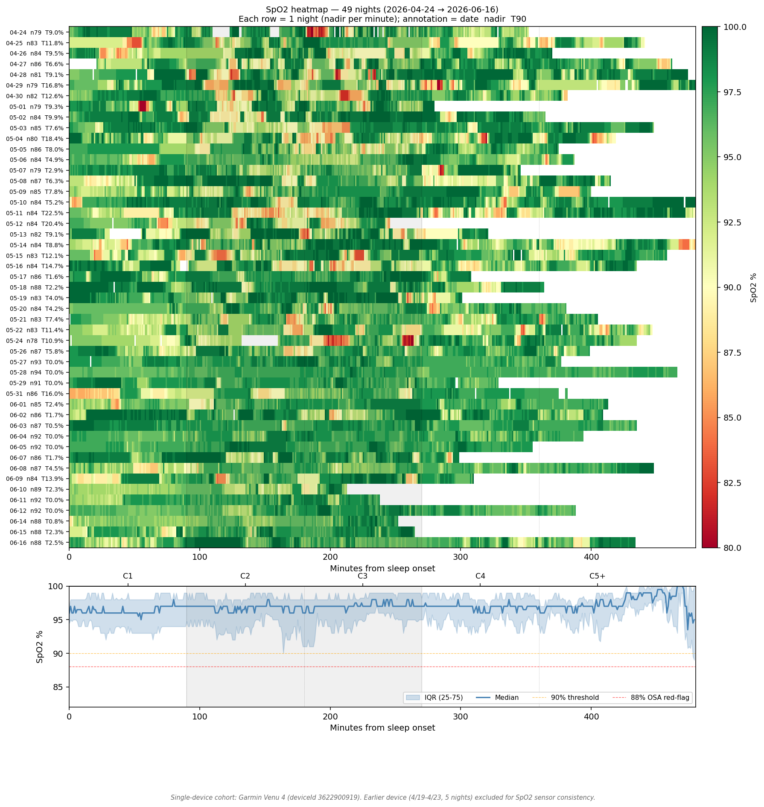
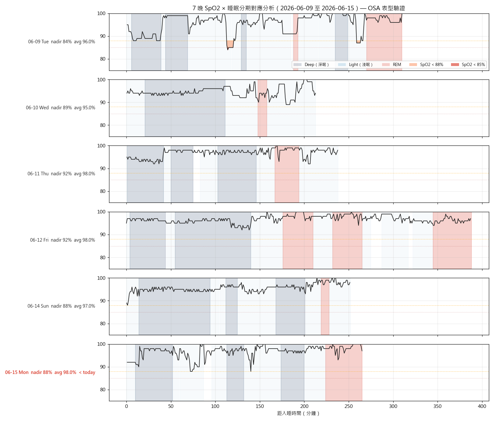

# 晨間健康紀錄 — 2026-06-15

*3 分鐘。起床後立即完成。記錄，不分析。*

---

## 體重 / 體組成

**今日：66.5 kg**
**體脂率：17.3 %**（⚠️ 輝葉八電極 HYG-P100 **preview 讀數**，非官方序列）
**內臟脂肪等級：3**（輝葉八電極 preview；健康區 1–12 內）
**腰圍 (WHO midpoint)：— cm**
**腰圍 (最大腹圍)：— cm**

*換機過渡計畫（2026-06-15 確認）：*
*- **Tanita 用到 6/17**（Month 3 健檢節點），維持官方序列連續。*
*- **6/17 之後正式改用輝葉八電極**（octopolar，準確度高於四電極腳對腳）為新官方尺。*
*- 今日 17.3% / VFL 3 為輝葉 preview，**不併入 Tanita 趨勢、不讀成減脂**。輝葉新 baseline 約 BF 17% / VFL 3。*
*- 裝置偏移（輝葉 vs Tanita）：體脂約 −1.7%、內臟脂肪約 −6。量測條件固定：晨起、排尿後、空腹。*
*今日為週一，非正式週記錄日（週六為正式）。*

---

## 血壓（晨間）

*今日無測量（no BP）。*

| 次數 | 收縮壓 | 舒張壓 | 心率 |
|------|--------|--------|------|
| 第一次 | — | — | — |
| 第二次 | — | — | — |

---

## 睡眠狀態

**Garmin 偵測入睡：** 23:24
**實際起床：** 03:49
**中途醒來：** 無（0 次）
**Garmin Sleep Score：** 61 / 100
**Garmin Body Battery 起床值：** 27
**主觀恢復感：** 3 / 5
**總時長：** 4h 15m（深眠 87 分／REM 41 分）

### SpO2 夜間最低（7 晚趨勢）

| 日期 | -6 | -5 | -4 | -3 | -2 | -1 | 今晨 |
|------|----|----|----|----|----|----|------|
| 日期 | 06-09 | 06-10 | 06-11 | 06-12 | 06-13 | 06-14 | 06-15 |
| 最低 % | 87 | 87 | 91 | 88 | — | 88 | 88 |

**今晨日均 SpO2：** 97%
**< 88% 連續晚數：** 0（近 3 晚皆 88%，貼門檻未跌破；持續觀察）

**SpO2 全夜圖（含 hypnogram 條帶）：** 
**SpO2 趨勢圖：** 
**SpO2 全夜 Heatmap（Venu 4 cohort）：** 
**SpO2 × 睡眠分期 7 晚疊圖：** 

*⚠️ Sleep Score 連兩日 < 65（6/14=51、6/15=61）+ TST 僅 4h15m + Body Battery 27。睡眠負債明顯，今晚務必執行 wind-down，目標上床 21:30。*

---

## 昨日回顧

**實際飲水量：** 1.5 L（⚠️ < 2.0L，已回寫 Garmin Connect；高尿酸目標 2.8–3.0L，落差大）
**昨日活動消耗：** 僅 BMR（6/14 無運動紀錄，步數 7,337）→ 今日加強運動，補一段 Zone 2 走路
**昨日 Na / K / Na-K ratio：** —（無飲食紀錄）

---

## 身體信號

| 部位 | 性質 | 強度 (0-10) |
|------|------|-------------|
| 清 | — | — |

---

## 今日計畫速記

- [ ] 飲水目標：2.5 L（錨點 09:30 ≥1.0L / 13:30 ≥2.0L / 17:00 截止 2.5L）
- [ ] 補充品（核心，2026-05-11 v2）：
  - 早餐（06:00）：D3 2000 IU + K2 MK-7 180 mcg + L-Citrulline 4 g + 益生菌
  - 午餐前 30 min：Psyllium 5 g + 350 mL 水
  - 晚餐前 30 min：Psyllium 5 g + 350 mL 水
  - 晚餐後：魚油 ×4（拆 18:30 ×2 + 19:30 ×2）
  - 睡前（21:00）：鎂甘胺酸 400 mg + 酸櫻桃 1000-2000 mg + Glycine 純粉 3 g
  - 茶飲：洛神花 ×2 杯（早 + 14:00 前）
  - 食物層：南瓜籽 30 g（15:30）+ 菇蕈 100-130 g/天
- [ ] 運動（17:00 固定）：散步（預設）
- [ ] 活動度/伸展（09:30 + 20:30 兩次錨點）
- [ ] Wind-down（20:00 燈光降 + 螢幕濾鏡，液體截止）
- [ ] 上床 21:30 / 熄燈 22:00（TST 目標 7h+）

---

*Filed: reviews/daily/2026-06-15.md*
