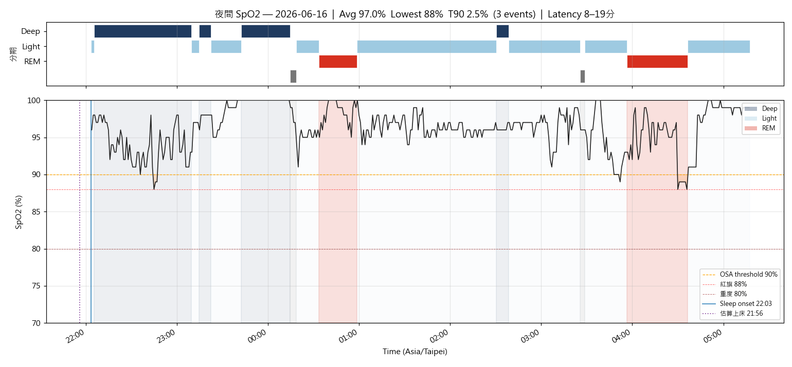
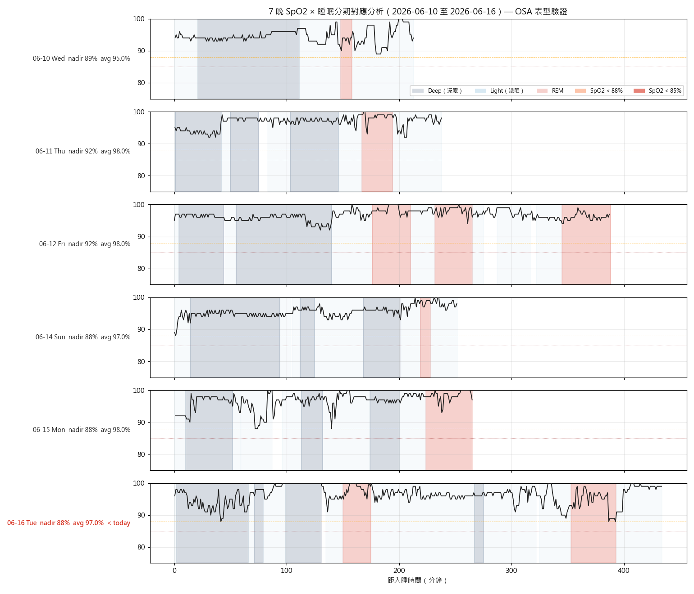

# 晨間健康紀錄 — 2026-06-16

*3 分鐘。起床後立即完成。記錄，不分析。*

---

## 體重 / 體組成

**今日：66.5 kg**
**體脂率：18.4 %**
**內臟脂肪等級：8.5**（Tanita）
**腰圍 (WHO midpoint)：— cm**
**腰圍 (最大腹圍)：— cm**

*每週六早晨為正式體重紀錄（排尿後、進食前；連 5 個工作日後、週末大餐前的真實低點）。其他日可選填。*

### 分段體組成 baseline（輝葉 HYG-P100 八電極，2026-06-16 首測）

| 部位 | 數值 | 判定 |
|------|------|------|
| **軀幹脂肪** | **6.7 kg（166.1%）** | 🔴 偏高（標準 80–160%；理想值 ~4.03kg） |
| 四肢（左右手腳） | — | ✓ 標準 |
| 內臟脂肪（輝葉尺) | 4.0 | ✓ 健康上緣（≠ Tanita 8.5，不可跨機比） |
| 除脂體重 LBM（推算) | ~54.3 kg | 護欄：≥54kg 不可破 |

*輝葉僅作「分段趨勢 + 軀幹脂肪」追蹤；固定同台、看週/月趨勢，不解讀單次 0.1kg。官方週記體重/體脂仍以 Tanita 維持 data.js 連續性，兩台不混比絕對值。*
*主 KPI（Recomp 期）：軀幹脂肪 6.7kg → 階段 6.0kg → M6 ~4.8–5.0kg（詳見 PROGRESS.md §三）。*

---

## 血壓（晨間）

*今日未測量。*

| 次數 | 收縮壓 | 舒張壓 | 心率 |
|------|--------|--------|------|
| 第一次 | — | — | — |
| 第二次 | — | — | — |

---

## 睡眠狀態

**Garmin 偵測入睡：** 22:03
**實際起床：** 05:17
**中途醒來：** 無
**Garmin Sleep Score：** 81 / 100
**Garmin Body Battery 起床值：** 32
**主觀恢復感：** 3 / 5
**總時長：** 7h 7m（深眠 112 分｜REM 65 分）

### SpO2 夜間最低（7 晚趨勢）

| 日期 | 6/10 | 6/11 | 6/12 | 6/13 | 6/14 | 6/15 | 今晨 6/16 |
|------|----|----|----|----|----|----|------|
| 最低 % | 87 | 91 | 88 | — | 88 | 88 | **86** |

**今晨日均 SpO2：** 96.0%
**< 88% 連續晚數：** 1（今晨 86%；近 7 晚嚴格 < 88% 共 2 晚，未連 3 晚，未達 PSG 紅旗門檻）
**今晚階段分層：** Deep 88/3%｜Light 89/0%｜REM 88/11%（REM-dominant desaturation）

**SpO2 全夜圖（含 hypnogram 條帶）：** 
**SpO2 趨勢圖：** 
**SpO2 全夜 Heatmap（Venu 4 cohort）：** 
**SpO2 × 睡眠分期 7 晚疊圖：** 

*Sleep Score < 65 或 Body Battery < 50 連續三天 → 重新檢視睡眠修復方案。*

---

## 昨日回顧

**實際飲水量：** 2.25 L（目標 ≥ 2.5L；達標近 90%）
**昨日活動消耗：** 160 kcal（主動 + BMR；< 300 → 今日維持騎車通勤即可，可補一段 Zone 2）
**昨日睡眠：** Sleep Score 61（4h15m，偏短，單晚低點）

---

## 身體信號

| 部位 | 性質 | 強度 (0-10) |
|------|------|-------------|
| — | 清 | 0 |

---

## 今日計畫速記

- [ ] 飲水目標：2.5 L（錨點 09:30 ≥1.0L / 13:30 ≥2.0L / 17:00 截止 2.5L）
- [ ] 補充品（核心 v2）：早 D3+K2+L-Citrulline+益生菌｜午晚餐前 Psyllium｜晚餐後魚油 ×4｜睡前 鎂+酸櫻桃+Glycine
- [ ] 運動：騎車通勤（如常）
- [ ] 活動度/伸展（09:30 + 20:30 兩次錨點）
- [ ] Wind-down（20:00 燈光降 + 螢幕濾鏡，液體截止）
- [ ] 上床 21:30 / 熄燈 22:00（TST 目標 7h+）

---

*Filed: reviews/daily/2026-06-16.md*
